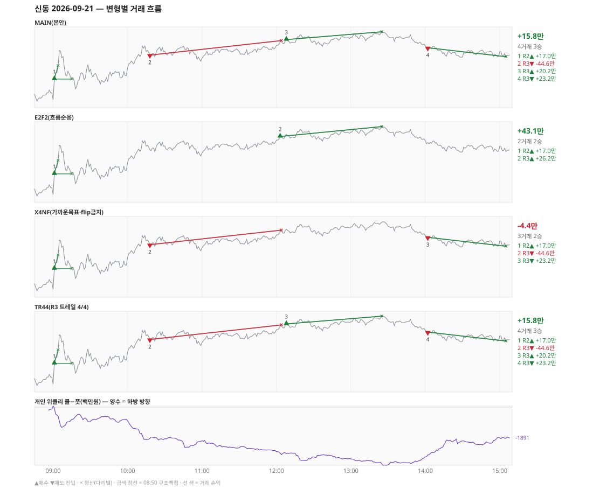

# 신동 일일 리포트 — 2026-09-21

> 생성 2026-09-28 17:42 · 규격 `SD-2026-09-24-v1` · 상품 `wk_mon` (최근접 만기 월위클리 (만기 2026-09-21))
> 가상거래다 — 주문 없음(절대원칙 §6). 손익은 미니선물 2계약 · CYBOS 요율 · 1틱 슬리피지 기준.

## 0. 한눈에

| 시장 | R1 장전 | R2 개장확정 | R1 적중(09:00→15:05) |
|---|---|---|---|
| 1092.46 → 1104.84 (+12.38) · 고 1112.18 · 저 1092.10 · 폭 20.1pt | 콜−풋 -63 → **상방** | CONFIRMED 09:01 | ✅ 적중 |

| 변형 | 거래 | 승 | R2 | R3 | **순손익** | 최악 거래 | MAIN 대비 | 기록 |
|---|---|---|---|---|---|---|---|---|
| MAIN(본안) | 4 | 3 | +17.0만 | -1.2만 | **+15.8만** | -44.6만 | — | 라이브 |
| E2F2(흐름순응) | 2 | 2 | +17.0만 | +26.2만 | **+43.1만** | +17.0만 | +27.3만 | 라이브 |
| X4NF(가까운목표·flip금지) | 3 | 2 | +17.0만 | -21.3만 | **-4.4만** | -44.6만 | -20.2만 | 재계산 |
| TR44(R3 트레일 4/4) | 4 | 3 | +17.0만 | -1.2만 | **+15.8만** | -44.6만 | +0.0만 | 재계산 |

**오늘의 한 줄** — MAIN +15.8만(4거래 3승), 최선은 E2F2(흐름순응) +43.1만(MAIN 대비 +27.3만).

> 「재계산」 = 그날 라이브 기록이 없어 엔진으로 다시 돌린 값(같은 엔진·같은 입력). 탐지 시각은 없다.

## 1. 차트

## 2. 거래 흐름 — MAIN

| # | 규칙 | 방향 | 진입 | 맥점 | 손절 | 1차 · 최종 | 청산(다리별) | MFE | 손익 | 누적 |
|---|---|---|---|---|---|---|---|---|---|---|
| 1 | R2 | 매수 | 09:01 1098.40 | - | 1091.10 | 1102.29 · 1112.03 | 1차 09:04 1102.29 · 본전 09:15 1098.40 | 9.7 | **+17.0만** | +17.0만 |
| 2 | R3 | 매도 | 10:18 1105.30 | 1108.0 | 1109.50 | 1090.50 · 1083.50 | 손절 12:04 1109.50 · 손절 12:04 1109.50 | 2.0 | **-44.6만** | -27.6만 |
| 3 | R3 | 매수 | 12:08 1109.78 | 1108.0 | 1106.50 | 1112.03 · 1112.03 | 1차 13:25 1112.03 · 최종 13:25 1112.03 | 2.4 | **+20.2만** | -7.4만 |
| 4 | R3 | 매도 | 14:02 1107.42 | 1108.0 | 1109.50 | 1090.50 · 1083.50 | 시간 15:05 1104.84 · 시간 15:05 1104.84 | 2.8 | **+23.2만** | +15.8만 |

## 3. 섀도 흐름 — MAIN 과 무엇이 달랐나

### E2F2(흐름순응) — +43.1만 (MAIN 대비 +27.3만)

- 10:18 R3 매도: MAIN 진입 1105.30 → **F2 차단(당일 흐름 역방향)** (MAIN 손익 -44.6만 제외)
- 12:08 R3 매수: MAIN 진입 1109.78 → **앞 거래 보유 중/시점 이동** (MAIN 손익 +20.2만 제외)
- 14:02 R3 매도: MAIN 진입 1107.42 → **F2 차단(당일 흐름 역방향)** (MAIN 손익 +23.2만 제외)
- 12:03 R3 매수: **섀도만 진입** 1109.18 (앞 거래가 없어 신호가 살아남) → +26.2만

| # | 규칙 | 방향 | 진입 | 맥점 | 손절 | 1차 · 최종 | 청산(다리별) | MFE | 손익 | 누적 |
|---|---|---|---|---|---|---|---|---|---|---|
| 1 | R2 | 매수 | 09:01 1098.40 | - | 1091.10 | 1102.29 · 1112.03 | 1차 09:04 1102.29 · 본전 09:15 1098.40 | 9.7 | **+17.0만** | +17.0만 |
| 2 | R3 | 매수 | 12:03 1109.18 | 1108.0 | 1106.50 | 1112.03 · 1112.03 | 1차 13:25 1112.03 · 최종 13:25 1112.03 | 3.0 | **+26.2만** | +43.1만 |

### X4NF(가까운목표·flip금지) — -4.4만 (MAIN 대비 -20.2만)

- 12:08 R3 매수: MAIN 진입 1109.78 → **flip 금지(같은 맥점 1108.0 반대 방향)** (MAIN 손익 +20.2만 제외)

| # | 규칙 | 방향 | 진입 | 맥점 | 손절 | 1차 · 최종 | 청산(다리별) | MFE | 손익 | 누적 |
|---|---|---|---|---|---|---|---|---|---|---|
| 1 | R2 | 매수 | 09:01 1098.40 | - | 1091.10 | 1102.29 · 1112.03 | 1차 09:04 1102.29 · 본전 09:15 1098.40 | 9.7 | **+17.0만** | +17.0만 |
| 2 | R3 | 매도 | 10:18 1105.30 | 1108.0 | 1109.50 | 1090.50 · 1083.50 | 손절 12:04 1109.50 · 손절 12:04 1109.50 | 2.0 | **-44.6만** | -27.6만 |
| 3 | R3 | 매도 | 14:02 1107.42 | 1108.0 | 1109.50 | 1090.50 · 1083.50 | 시간 15:05 1104.84 · 시간 15:05 1104.84 | 2.8 | **+23.2만** | -4.4만 |

### TR44(R3 트레일 4/4) — +15.8만 (MAIN 대비 +0.0만)

- MAIN 과 같다

| # | 규칙 | 방향 | 진입 | 맥점 | 손절 | 1차 · 최종 | 청산(다리별) | MFE | 손익 | 누적 |
|---|---|---|---|---|---|---|---|---|---|---|
| 1 | R2 | 매수 | 09:01 1098.40 | - | 1091.10 | 1102.29 · 1112.03 | 1차 09:04 1102.29 · 본전 09:15 1098.40 | 9.7 | **+17.0만** | +17.0만 |
| 2 | R3 | 매도 | 10:18 1105.30 | 1108.0 | 1109.50 | 1090.50 · 1083.50 | 손절 12:04 1109.50 · 손절 12:04 1109.50 | 2.0 | **-44.6만** | -27.6만 |
| 3 | R3 | 매수 | 12:08 1109.78 | 1108.0 | 1106.50 | 1112.03 · 1112.03 | 1차 13:25 1112.03 · 최종 13:25 1112.03 | 2.4 | **+20.2만** | -7.4만 |
| 4 | R3 | 매도 | 14:02 1107.42 | 1108.0 | 1109.50 | 1090.50 · 1083.50 | 시간 15:05 1104.84 · 시간 15:05 1104.84 | 2.8 | **+23.2만** | +15.8만 |

## 4. 누적 채점 (라이브 기록 · 판정 창)

| 변형 | 채점 시작 | 거래일 | 거래 | 승률 | 순손익 | 최악일 | R3 (건 · 승률 · 순) | 판정 |
|---|---|---|---|---|---|---|---|---|
| MAIN(본안) | 2026-09-28 | 0 | - | - | - | - | - | 기록 전 |
| E2F2(흐름순응) | 2026-09-28 | 0 | - | - | - | - | - | 기록 전 |
| X4NF(가까운목표·flip금지) | 2026-09-29 | 0 | - | - | - | - | - | 기록 전 |
| TR44(R3 트레일 4/4) | 2026-09-29 | 0 | - | - | - | - | - | 기록 전 |

> 판정 전 집계다 — 인용·규격 변경 근거로 쓰지 말 것. R3 중단 기준: 순손익 < 0 **그리고** 승률 < 35%.

## 5. 러너 섀도 — 미륵이 × 신동 (CREON 요율)

- 오늘 기록 없음 — 미륵이 시스템 진입이 없었거나 장후 기록 전이다

## 6. 개선 방향 (자동 관찰 — 판정 아님)

- **진입 품질** — MAIN 손실 1건 중 1건은 유리한 쪽으로 4pt 도 못 갔다(MFE 2.0). 청산을 바꿔서는 못 막는 손실이다 → 진입 필터(E2F2·X4NF) 쪽 관찰 대상.
- **맥점 반복** — 1108.0 에서 R3 3회(매도→매수→매도) · 합 -1.2만. 박스권에서 같은 맥점을 양쪽으로 번갈아 잡았다.
- **오늘 최선은 E2F2(흐름순응)** (+43.1만, MAIN 대비 +27.3만). 하루 결과다 — 판정은 사전등록 창(10거래일)으로만.
- ⚠ 규격 변경은 사전등록 §6(새 버전 · 재채점)으로만. 이 절은 관찰이다.

---
재생성: `python scripts/shindong_daily_report.py 2026-09-21`
