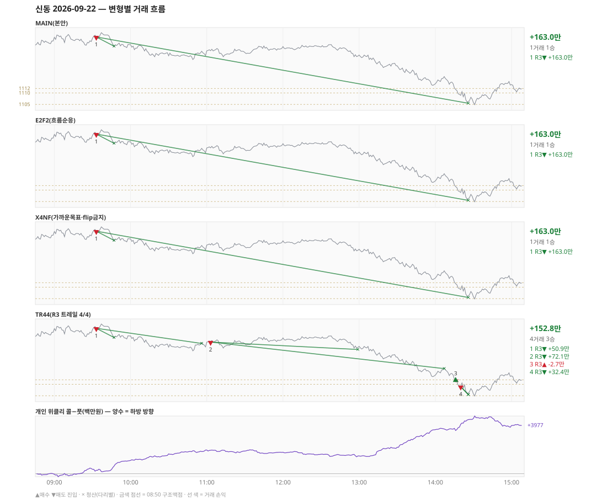

# 신동 일일 리포트 — 2026-09-22

> 생성 2026-09-28 17:42 · 규격 `SD-2026-09-24-v1` · 상품 `wk_thu` (최근접 만기 목위클리 (만기 2026-09-23))
> 가상거래다 — 주문 없음(절대원칙 §6). 손익은 미니선물 2계약 · CYBOS 요율 · 1틱 슬리피지 기준.

## 0. 한눈에

| 시장 | R1 장전 | R2 개장확정 | R1 적중(09:00→15:05) |
|---|---|---|---|
| 1134.40 → 1111.46 (-22.94) · 고 1136.70 · 저 1104.34 · 폭 32.4pt | 콜−풋 -7 → **보류** | - | 미측정/보류 |

| 변형 | 거래 | 승 | R2 | R3 | **순손익** | 최악 거래 | MAIN 대비 | 기록 |
|---|---|---|---|---|---|---|---|---|
| MAIN(본안) | 1 | 1 | +0.0만 | +163.0만 | **+163.0만** | +163.0만 | — | 라이브 |
| E2F2(흐름순응) | 1 | 1 | +0.0만 | +163.0만 | **+163.0만** | +163.0만 | +0.0만 | 라이브 |
| X4NF(가까운목표·flip금지) | 1 | 1 | +0.0만 | +163.0만 | **+163.0만** | +163.0만 | +0.0만 | 재계산 |
| TR44(R3 트레일 4/4) | 4 | 3 | +0.0만 | +152.8만 | **+152.8만** | -2.7만 | -10.2만 | 재계산 |

**오늘의 한 줄** — MAIN +163.0만(1거래 1승).

> 「재계산」 = 그날 라이브 기록이 없어 엔진으로 다시 돌린 값(같은 엔진·같은 입력). 탐지 시각은 없다.

## 1. 차트

## 2. 거래 흐름 — MAIN

| # | 규칙 | 방향 | 진입 | 맥점 | 손절 | 1차 · 최종 | 청산(다리별) | MFE | 손익 | 누적 |
|---|---|---|---|---|---|---|---|---|---|---|
| 1 | R3 | 매도 | 09:33 1134.54 | 1136.0 | 1137.50 | 1130.50 · 1105.50 | 1차 09:47 1130.50 · 최종 14:26 1105.50 | 29.1 | **+163.0만** | +163.0만 |

## 3. 섀도 흐름 — MAIN 과 무엇이 달랐나

### E2F2(흐름순응) — +163.0만 (MAIN 대비 +0.0만)

- MAIN 과 같다

| # | 규칙 | 방향 | 진입 | 맥점 | 손절 | 1차 · 최종 | 청산(다리별) | MFE | 손익 | 누적 |
|---|---|---|---|---|---|---|---|---|---|---|
| 1 | R3 | 매도 | 09:33 1134.54 | 1136.0 | 1137.50 | 1130.50 · 1105.50 | 1차 09:47 1130.50 · 최종 14:26 1105.50 | 29.1 | **+163.0만** | +163.0만 |

### X4NF(가까운목표·flip금지) — +163.0만 (MAIN 대비 +0.0만)

- MAIN 과 같다

| # | 규칙 | 방향 | 진입 | 맥점 | 손절 | 1차 · 최종 | 청산(다리별) | MFE | 손익 | 누적 |
|---|---|---|---|---|---|---|---|---|---|---|
| 1 | R3 | 매도 | 09:33 1134.54 | 1136.0 | 1137.50 | 1130.50 · 1105.50 | 1차 09:47 1130.50 · 최종 14:26 1105.50 | 29.1 | **+163.0만** | +163.0만 |

### TR44(R3 트레일 4/4) — +152.8만 (MAIN 대비 -10.2만)

- 09:33 R3 매도: 청산 차이 — MAIN 1차/최종 → 1차/트레일 (+163.0만 → +50.9만, 차 -112.1만)
- 11:03 R3 매도: **섀도만 진입** 1128.52 (앞 거래가 없어 신호가 살아남) → +72.1만
- 14:16 R3 매수: **섀도만 진입** 1111.54 (앞 거래가 없어 신호가 살아남) → -2.7만
- 14:20 R3 매도: **섀도만 진입** 1108.98 (앞 거래가 없어 신호가 살아남) → +32.4만

| # | 규칙 | 방향 | 진입 | 맥점 | 손절 | 1차 · 최종 | 청산(다리별) | MFE | 손익 | 누적 |
|---|---|---|---|---|---|---|---|---|---|---|
| 1 | R3 | 매도 | 09:33 1134.54 | 1136.0 | 1137.50 | 1130.50 · 1105.50 | 1차 09:47 1130.50 · 트레일 10:56 1127.90 | 10.6 | **+50.9만** | +50.9만 |
| 2 | R3 | 매도 | 11:03 1128.52 | 1130.0 | 1131.50 | 1125.25 · 1105.50 | 1차 12:59 1125.25 · 트레일 14:07 1116.86 | 15.7 | **+72.1만** | +123.0만 |
| 3 | R3 | 매수 | 14:16 1111.54 | 1112.0 | 1110.50 | 1111.50 · 1135.50 | 1차 14:17 1111.50 · 본전 14:17 1111.54 | 0.4 | **-2.7만** | +120.3만 |
| 4 | R3 | 매도 | 14:20 1108.98 | 1110.0 | 1111.62 | 1105.50 · 1105.50 | 1차 14:26 1105.50 · 최종 14:26 1105.50 | 3.6 | **+32.4만** | +152.8만 |

## 4. 누적 채점 (라이브 기록 · 판정 창)

| 변형 | 채점 시작 | 거래일 | 거래 | 승률 | 순손익 | 최악일 | R3 (건 · 승률 · 순) | 판정 |
|---|---|---|---|---|---|---|---|---|
| MAIN(본안) | 2026-09-28 | 0 | - | - | - | - | - | 기록 전 |
| E2F2(흐름순응) | 2026-09-28 | 0 | - | - | - | - | - | 기록 전 |
| X4NF(가까운목표·flip금지) | 2026-09-29 | 0 | - | - | - | - | - | 기록 전 |
| TR44(R3 트레일 4/4) | 2026-09-29 | 0 | - | - | - | - | - | 기록 전 |

> 판정 전 집계다 — 인용·규격 변경 근거로 쓰지 말 것. R3 중단 기준: 순손익 < 0 **그리고** 승률 < 35%.

## 5. 러너 섀도 — 미륵이 × 신동 (CREON 요율)

| 미륵이 진입 | 방향 | 조건 | 러너 | 실제 | 러너 적용 | 차이 | 필터 B |
|---|---|---|---|---|---|---|---|
| 11:02 1128.76 ×2 | 매수 | 불충족 | 신동 방향 보류 | +4.2만 | +4.2만 | **+0.0만** | 제외 |
| 13:16 1123.52 ×2 | 매도 | 불충족 | 신동 방향 보류 | +8.8만 | +8.8만 | **+0.0만** | 통과 |

- 합: 실제 +12.9만 → 러너 +12.9만 (차 +0.0만)

## 6. 개선 방향 (자동 관찰 — 판정 아님)

- **오늘은 MAIN 이 최선** (+163.0만).
- ⚠ 규격 변경은 사전등록 §6(새 버전 · 재채점)으로만. 이 절은 관찰이다.

---
재생성: `python scripts/shindong_daily_report.py 2026-09-22`
