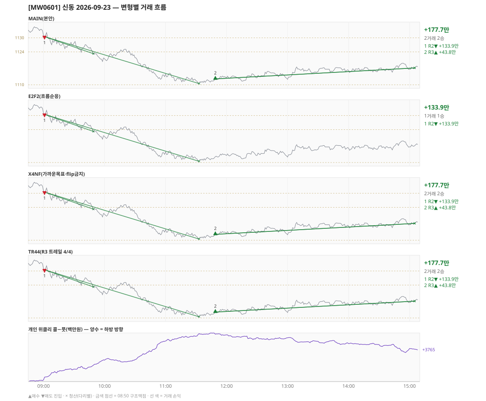

# [MW0601] 신동 일일 리포트 — 2026-09-23

> **MW0601 리포트** · 생성 2026-09-28 18:23 · 규격 `SD-2026-09-24-v1` · 상품 `wk_thu` (최근접 만기 목위클리 (만기 2026-09-23))
> 가상거래다 — 주문 없음(절대원칙 §6). 손익은 미니선물 2계약 · CYBOS 요율 · 1틱 슬리피지 기준.

## 0. 한눈에

| 시장 | R1 장전 | R2 개장확정 | R1 적중(09:00→15:05) |
|---|---|---|---|
| 1130.96 → 1117.16 (-13.80) · 고 1134.42 · 저 1110.00 · 폭 24.4pt | 콜−풋 +114 → **하방** | CONFIRMED 09:01 | ✅ 적중 |

| 변형 | 거래 | 승 | R2 | R3 | **순손익** | 최악 거래 | MAIN 대비 | 기록 |
|---|---|---|---|---|---|---|---|---|
| MAIN(본안) | 2 | 2 | +133.9만 | +43.8만 | **+177.7만** | +43.8만 | — | 라이브 |
| E2F2(흐름순응) | 1 | 1 | +133.9만 | +0.0만 | **+133.9만** | +133.9만 | -43.8만 | 라이브 |
| X4NF(가까운목표·flip금지) | 2 | 2 | +133.9만 | +43.8만 | **+177.7만** | +43.8만 | +0.0만 | 재계산 |
| TR44(R3 트레일 4/4) | 2 | 2 | +133.9만 | +43.8만 | **+177.7만** | +43.8만 | +0.0만 | 재계산 |

**오늘의 한 줄** — MAIN +177.7만(2거래 2승).

> 「재계산」 = 그날 라이브 기록이 없어 엔진으로 다시 돌린 값(같은 엔진·같은 입력). 탐지 시각은 없다.

## 1. 차트

## 2. 거래 흐름 — MAIN

| # | 규칙 | 방향 | 진입 | 맥점 | 손절 | 1차 · 최종 | 청산(다리별) | MFE | 손익 | 누적 |
|---|---|---|---|---|---|---|---|---|---|---|
| 1 | R2 | 매도 | 09:01 1130.50 | - | 1135.42 | 1123.24 · 1110.50 | 1차 09:49 1123.24 · 최종 11:33 1110.50 | 20.5 | **+133.9만** | +133.9만 |
| 2 | R3 | 매수 | 11:49 1112.52 | 1110.0 | 1108.50 | 1134.50 · 1136.50 | 시간 15:05 1117.16 · 시간 15:05 1117.16 | 7.1 | **+43.8만** | +177.7만 |

## 3. 섀도 흐름 — MAIN 과 무엇이 달랐나

### E2F2(흐름순응) — +133.9만 (MAIN 대비 -43.8만)

- 11:49 R3 매수: MAIN 진입 1112.52 → **F2 차단(당일 흐름 역방향)** (MAIN 손익 +43.8만 제외)

| # | 규칙 | 방향 | 진입 | 맥점 | 손절 | 1차 · 최종 | 청산(다리별) | MFE | 손익 | 누적 |
|---|---|---|---|---|---|---|---|---|---|---|
| 1 | R2 | 매도 | 09:01 1130.50 | - | 1135.42 | 1123.24 · 1110.50 | 1차 09:49 1123.24 · 최종 11:33 1110.50 | 20.5 | **+133.9만** | +133.9만 |

### X4NF(가까운목표·flip금지) — +177.7만 (MAIN 대비 +0.0만)

- MAIN 과 같다

| # | 규칙 | 방향 | 진입 | 맥점 | 손절 | 1차 · 최종 | 청산(다리별) | MFE | 손익 | 누적 |
|---|---|---|---|---|---|---|---|---|---|---|
| 1 | R2 | 매도 | 09:01 1130.50 | - | 1135.42 | 1123.24 · 1110.50 | 1차 09:49 1123.24 · 최종 11:33 1110.50 | 20.5 | **+133.9만** | +133.9만 |
| 2 | R3 | 매수 | 11:49 1112.52 | 1110.0 | 1108.50 | 1123.50 · 1136.50 | 시간 15:05 1117.16 · 시간 15:05 1117.16 | 7.1 | **+43.8만** | +177.7만 |

### TR44(R3 트레일 4/4) — +177.7만 (MAIN 대비 +0.0만)

- MAIN 과 같다

| # | 규칙 | 방향 | 진입 | 맥점 | 손절 | 1차 · 최종 | 청산(다리별) | MFE | 손익 | 누적 |
|---|---|---|---|---|---|---|---|---|---|---|
| 1 | R2 | 매도 | 09:01 1130.50 | - | 1135.42 | 1123.24 · 1110.50 | 1차 09:49 1123.24 · 최종 11:33 1110.50 | 20.5 | **+133.9만** | +133.9만 |
| 2 | R3 | 매수 | 11:49 1112.52 | 1110.0 | 1108.50 | 1134.50 · 1136.50 | 시간 15:05 1117.16 · 시간 15:05 1117.16 | 7.1 | **+43.8만** | +177.7만 |

## 4. 누적 채점 (라이브 기록 · 판정 창)

| 변형 | 채점 시작 | 거래일 | 거래 | 승률 | 순손익 | 최악일 | R3 (건 · 승률 · 순) | 판정 |
|---|---|---|---|---|---|---|---|---|
| MAIN(본안) | 2026-09-28 | 0 | - | - | - | - | - | 기록 전 |
| E2F2(흐름순응) | 2026-09-28 | 0 | - | - | - | - | - | 기록 전 |
| X4NF(가까운목표·flip금지) | 2026-09-29 | 0 | - | - | - | - | - | 기록 전 |
| TR44(R3 트레일 4/4) | 2026-09-29 | 0 | - | - | - | - | - | 기록 전 |

> 판정 전 집계다 — 인용·규격 변경 근거로 쓰지 말 것. R3 중단 기준: 순손익 < 0 **그리고** 승률 < 35%.

## 5. 러너 섀도 — 미륵이 × 신동 (CREON 요율)

| 미륵이 진입 | 방향 | 조건 | 러너 | 실제 | 러너 적용 | 차이 | 필터 B |
|---|---|---|---|---|---|---|---|
| 10:36 1119.00 ×2 | 매도 | 충족 | BE 10:39 | +2.4만 | +2.3만 | **-0.1만** | 통과 |

- 합: 실제 +2.4만 → 러너 +2.3만 (차 -0.1만)

## 6. 개선 방향 (자동 관찰 — 판정 아님)

- **오늘은 MAIN 이 최선** (+177.7만).
- ⚠ 규격 변경은 사전등록 §6(새 버전 · 재채점)으로만. 이 절은 관찰이다.

---
재생성: `python scripts/shindong_daily_report.py 2026-09-23`
