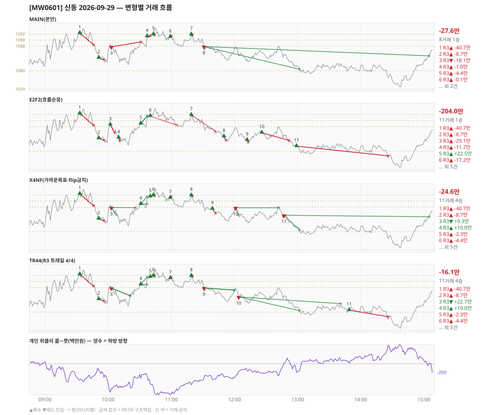

# [MW0601] 신동 일일 리포트 — 2026-09-29

> **MW0601 리포트** · 생성 2026-09-29 15:40 · 규격 `SD-2026-09-24-v1` · 상품 `wk_thu` (최근접 만기 목위클리 (만기 2026-10-01))
> 가상거래다 — 주문 없음(절대원칙 §6). 손익은 미니선물 2계약 · CYBOS 요율 · 1틱 슬리피지 기준.

## 0. 한눈에

| 시장 | R1 장전 | R2 개장확정 | R1 적중(09:00→15:05) |
|---|---|---|---|
| 1082.28 → 1084.86 (+2.58) · 고 1094.44 · 저 1074.48 · 폭 20.0pt | 콜−풋 +34 → **보류** | - | 미측정/보류 |

| 변형 | 거래 | 승 | R2 | R3 | **순손익** | 최악 거래 | MAIN 대비 | 기록 |
|---|---|---|---|---|---|---|---|---|
| MAIN(본안) | 8 | 1 | +0.0만 | -27.6만 | **-27.6만** | -40.7만 | — | 라이브 |
| E2F2(흐름순응) | 11 | 1 | +0.0만 | -204.0만 | **-204.0만** | -40.7만 | -176.4만 | 라이브 |
| X4NF(가까운목표·flip금지) | 11 | 4 | +0.0만 | -24.6만 | **-24.6만** | -40.7만 | +3.0만 | 라이브 |
| TR44(R3 트레일 4/4) | 11 | 4 | +0.0만 | -16.1만 | **-16.1만** | -40.7만 | +11.5만 | 라이브 |

**오늘의 한 줄** — MAIN -27.6만(8거래 1승), 최선은 TR44(R3 트레일 4/4) -16.1만(MAIN 대비 +11.5만).

## 1. 차트

## 2. 거래 흐름 — MAIN

| # | 규칙 | 방향 | 진입 | 맥점 | 손절 | 1차 · 최종 | 청산(다리별) | MFE | 손익 | 누적 |
|---|---|---|---|---|---|---|---|---|---|---|
| 1 | R3 | 매수 | 09:33 1092.32 (탐지 09:34) | 1090.0 | 1088.50 | 1098.36 · 1100.87 | 손절 09:46 1088.50 · 손절 09:46 1088.50 | 1.7 | **-40.7만** | -40.7만 |
| 2 | R3 | 매수 | 09:51 1084.20 (탐지 09:52) | 1088.0 | 1083.58 | 1091.50 · 1091.50 | 손절 09:56 1083.58 · 손절 09:56 1083.58 | 1.1 | **-8.7만** | -49.5만 |
| 3 | R3 | 매도 | 10:03 1087.84 (탐지 10:04) | 1085.0 | 1089.40 | 1080.50 · 1071.50 | 손절 10:31 1089.40 · 손절 10:31 1089.40 | 6.5 | **-18.1만** | -67.6만 |
| 4 | R3 | 매수 | 10:37 1091.22 (탐지 10:38) | 1088.0 | 1086.50 | 1091.50 · 1098.36 | 1차 10:40 1091.50 · 본전 10:40 1091.22 | 1.4 | **-1.0만** | -68.6만 |
| 5 | R3 | 매수 | 10:43 1091.90 (탐지 10:44) | 1090.0 | 1088.50 | 1091.50 · 1098.36 | 1차 10:44 1091.50 · 본전 10:44 1091.90 | 2.0 | **-4.4만** | -73.1만 |
| 6 | R3 | 매수 | 10:59 1091.04 (탐지 11:00) | 1090.0 | 1088.50 | 1091.50 · 1098.36 | 1차 11:00 1091.50 · 본전 11:00 1091.04 | 0.5 | **-0.1만** | -73.2만 |
| 7 | R3 | 매수 | 11:19 1091.84 (탐지 11:20) | 1088.0 | 1086.50 | 1091.50 · 1098.36 | 1차 11:20 1091.50 · 본전 11:20 1091.84 | -0.1 | **-4.1만** | -77.4만 |
| 8 | R3 | 매도 | 11:31 1087.90 (탐지 11:32) | 1090.0 | 1091.50 | 1080.50 · 1071.50 | 1차 13:02 1080.50 · 시간 15:05 1084.86 | 13.4 | **+49.8만** | -27.6만 |

## 3. 섀도 흐름 — MAIN 과 무엇이 달랐나

### E2F2(흐름순응) — -204.0만 (MAIN 대비 -176.4만)

- 10:03 R3 매도: MAIN 진입 1087.84 → **F2 차단(당일 흐름 역방향)** (MAIN 손익 -18.1만 제외)
- 10:37 R3 매수: MAIN 진입 1091.22 → **앞 거래 보유 중/시점 이동** (MAIN 손익 -1.0만 제외)
- 10:43 R3 매수: MAIN 진입 1091.90 → **앞 거래 보유 중/시점 이동** (MAIN 손익 -4.4만 제외)
- 10:59 R3 매수: MAIN 진입 1091.04 → **앞 거래 보유 중/시점 이동** (MAIN 손익 -0.1만 제외)
- 11:19 R3 매수: 청산 차이 — MAIN 1차/본전 → 1차/손절 (-4.1만 → -30.8만, 차 -26.7만)
- 11:31 R3 매도: MAIN 진입 1087.90 → **F2 차단(당일 흐름 역방향)** (MAIN 손익 +49.8만 제외)
- 10:02 R3 매수: **섀도만 진입** 1088.66 (앞 거래가 없어 신호가 살아남) → -29.1만
- 10:10 R3 매수: **섀도만 진입** 1084.42 (앞 거래가 없어 신호가 살아남) → -11.7만
- 10:31 R3 매수: **섀도만 진입** 1089.02 (앞 거래가 없어 신호가 살아남) → +22.5만
- 10:40 R3 매수: **섀도만 진입** 1091.48 (앞 거래가 없어 신호가 살아남) → -17.2만
- 11:50 R3 매수: **섀도만 진입** 1084.82 (앞 거래가 없어 신호가 살아남) → -15.7만
- 12:12 R3 매수: **섀도만 진입** 1083.66 (앞 거래가 없어 신호가 살아남) → -10.3만
- 12:26 R3 매수: **섀도만 진입** 1086.04 (앞 거래가 없어 신호가 살아남) → -27.9만
- 12:59 R3 매수: **섀도만 진입** 1081.66 (앞 거래가 없어 신호가 살아남) → -34.1만

| # | 규칙 | 방향 | 진입 | 맥점 | 손절 | 1차 · 최종 | 청산(다리별) | MFE | 손익 | 누적 |
|---|---|---|---|---|---|---|---|---|---|---|
| 1 | R3 | 매수 | 09:33 1092.32 (탐지 09:34) | 1090.0 | 1088.50 | 1098.36 · 1100.87 | 손절 09:46 1088.50 · 손절 09:46 1088.50 | 1.7 | **-40.7만** | -40.7만 |
| 2 | R3 | 매수 | 09:51 1084.20 (탐지 09:52) | 1088.0 | 1083.58 | 1091.50 · 1091.50 | 손절 09:56 1083.58 · 손절 09:56 1083.58 | 1.1 | **-8.7만** | -49.5만 |
| 3 | R3 | 매수 | 10:02 1088.66 (탐지 10:03) | 1088.0 | 1086.00 | 1091.50 · 1091.50 | 손절 10:06 1086.00 · 손절 10:06 1086.00 | 0.5 | **-29.1만** | -78.6만 |
| 4 | R3 | 매수 | 10:10 1084.42 (탐지 10:11) | 1085.0 | 1083.50 | 1091.50 · 1091.50 | 손절 10:11 1083.50 · 손절 10:11 1083.50 | 0.7 | **-11.7만** | -90.3만 |
| 5 | R3 | 매수 | 10:31 1089.02 (탐지 10:32) | 1085.0 | 1083.06 | 1091.50 · 1091.50 | 1차 10:37 1091.50 · 최종 10:37 1091.50 | 2.7 | **+22.5만** | -67.9만 |
| 6 | R3 | 매수 | 10:40 1091.48 (탐지 10:41) | 1090.0 | 1088.50 | 1091.50 · 1098.36 | 1차 10:41 1091.50 · 손절 11:05 1088.50 | 3.0 | **-17.2만** | -85.1만 |
| 7 | R3 | 매수 | 11:19 1091.84 (탐지 11:20) | 1088.0 | 1086.50 | 1091.50 · 1098.36 | 1차 11:20 1091.50 · 손절 11:42 1086.50 | -0.1 | **-30.8만** | -115.9만 |
| 8 | R3 | 매수 | 11:50 1084.82 (탐지 11:51) | 1085.0 | 1083.50 | 1091.50 · 1091.50 | 손절 11:52 1083.50 · 손절 11:52 1083.50 | 0.1 | **-15.7만** | -131.7만 |
| 9 | R3 | 매수 | 12:12 1083.66 (탐지 12:13) | 1085.0 | 1082.88 | 1091.50 · 1091.50 | 손절 12:13 1082.88 · 손절 12:13 1082.88 | 0.3 | **-10.3만** | -142.0만 |
| 10 | R3 | 매수 | 12:26 1086.04 (탐지 12:27) | 1085.0 | 1083.50 | 1091.50 · 1091.50 | 손절 12:52 1083.50 · 손절 12:52 1083.50 | 2.6 | **-27.9만** | -169.9만 |
| 11 | R3 | 매수 | 12:59 1081.66 (탐지 13:00) | 1080.0 | 1078.50 | 1091.50 · 1091.50 | 손절 14:26 1078.50 · 손절 14:26 1078.50 | 1.3 | **-34.1만** | -204.0만 |

### X4NF(가까운목표·flip금지) — -24.6만 (MAIN 대비 +3.0만)

- 10:03 R3 매도: 청산 차이 — MAIN 손절/손절 → 1차/본전 (-18.1만 → +9.3만, 차 +27.4만)
- 10:37 R3 매수: MAIN 진입 1091.22 → **앞 거래 보유 중/시점 이동** (MAIN 손익 -1.0만 제외)
- 11:31 R3 매도: MAIN 진입 1087.90 → **flip 금지(같은 맥점 1090.0 반대 방향)** (MAIN 손익 +49.8만 제외)
- 10:31 R3 매수: **섀도만 진입** 1089.02 (앞 거래가 없어 신호가 살아남) → +10.0만
- 10:40 R3 매수: **섀도만 진입** 1091.48 (앞 거래가 없어 신호가 살아남) → -2.3만
- 11:39 R3 매수: **섀도만 진입** 1087.46 (앞 거래가 없어 신호가 살아남) → -16.7만
- 12:01 R3 매도: **섀도만 진입** 1087.80 (앞 거래가 없어 신호가 살아남) → +9.1만
- 12:47 R3 매도: **섀도만 진입** 1085.36 (앞 거래가 없어 신호가 살아남) → +24.4만

| # | 규칙 | 방향 | 진입 | 맥점 | 손절 | 1차 · 최종 | 청산(다리별) | MFE | 손익 | 누적 |
|---|---|---|---|---|---|---|---|---|---|---|
| 1 | R3 | 매수 | 09:33 1092.32 (탐지 09:34) | 1090.0 | 1088.50 | 1096.50 · 1100.87 | 손절 09:46 1088.50 · 손절 09:46 1088.50 | 1.7 | **-40.7만** | -40.7만 |
| 2 | R3 | 매수 | 09:51 1084.20 (탐지 09:52) | 1088.0 | 1083.58 | 1087.50 · 1091.50 | 손절 09:56 1083.58 · 손절 09:56 1083.58 | 1.1 | **-8.7만** | -49.5만 |
| 3 | R3 | 매도 | 10:03 1087.84 (탐지 10:04) | 1085.0 | 1089.40 | 1085.50 · 1071.50 | 1차 10:08 1085.50 · 본전 10:26 1087.84 | 6.5 | **+9.3만** | -40.2만 |
| 4 | R3 | 매수 | 10:31 1089.02 (탐지 10:32) | 1088.0 | 1086.30 | 1091.50 · 1091.50 | 1차 10:37 1091.50 · 본전 10:37 1089.02 | 2.7 | **+10.0만** | -30.2만 |
| 5 | R3 | 매수 | 10:40 1091.48 (탐지 10:41) | 1090.0 | 1088.50 | 1091.50 · 1098.36 | 1차 10:41 1091.50 · 본전 10:41 1091.48 | 0.5 | **-2.3만** | -32.6만 |
| 6 | R3 | 매수 | 10:43 1091.90 (탐지 10:44) | 1090.0 | 1088.50 | 1091.50 · 1098.36 | 1차 10:44 1091.50 · 본전 10:44 1091.90 | 2.0 | **-4.4만** | -37.0만 |
| 7 | R3 | 매수 | 10:59 1091.04 (탐지 11:00) | 1090.0 | 1088.50 | 1091.50 · 1098.36 | 1차 11:00 1091.50 · 본전 11:00 1091.04 | 0.5 | **-0.1만** | -37.2만 |
| 8 | R3 | 매수 | 11:19 1091.84 (탐지 11:20) | 1088.0 | 1086.50 | 1091.50 · 1098.36 | 1차 11:20 1091.50 · 본전 11:20 1091.84 | -0.1 | **-4.1만** | -41.3만 |
| 9 | R3 | 매수 | 11:39 1087.46 (탐지 11:40) | 1088.0 | 1086.04 | 1089.50 · 1091.50 | 손절 11:42 1086.04 · 손절 11:42 1086.04 | 0.1 | **-16.7만** | -58.0만 |
| 10 | R3 | 매도 | 12:01 1087.80 (탐지 12:02) | 1085.0 | 1088.58 | 1085.50 · 1071.50 | 1차 12:04 1085.50 · 본전 12:42 1087.80 | 5.4 | **+9.1만** | -49.0만 |
| 11 | R3 | 매도 | 12:47 1085.36 (탐지 12:48) | 1085.0 | 1086.60 | 1080.50 · 1071.50 | 1차 13:02 1080.50 · 시간 15:05 1084.86 | 10.9 | **+24.4만** | -24.6만 |

### TR44(R3 트레일 4/4) — -16.1만 (MAIN 대비 +11.5만)

- 10:03 R3 매도: 청산 차이 — MAIN 손절/손절 → 트레일/트레일 (-18.1만 → +22.7만, 차 +40.8만)
- 10:37 R3 매수: MAIN 진입 1091.22 → **앞 거래 보유 중/시점 이동** (MAIN 손익 -1.0만 제외)
- 11:31 R3 매도: 청산 차이 — MAIN 1차/시간 → 트레일/트레일 (+49.8만 → +4.9만, 차 -44.9만)
- 10:31 R3 매수: **섀도만 진입** 1089.02 (앞 거래가 없어 신호가 살아남) → +10.0만
- 10:40 R3 매수: **섀도만 진입** 1091.48 (앞 거래가 없어 신호가 살아남) → -2.3만
- 12:04 R3 매도: **섀도만 진입** 1084.96 (앞 거래가 없어 신호가 살아남) → +30.9만
- 13:49 R3 매수: **섀도만 진입** 1080.64 (앞 거래가 없어 신호가 살아남) → -23.9만

| # | 규칙 | 방향 | 진입 | 맥점 | 손절 | 1차 · 최종 | 청산(다리별) | MFE | 손익 | 누적 |
|---|---|---|---|---|---|---|---|---|---|---|
| 1 | R3 | 매수 | 09:33 1092.32 (탐지 09:34) | 1090.0 | 1088.50 | 1098.36 · 1100.87 | 손절 09:46 1088.50 · 손절 09:46 1088.50 | 1.7 | **-40.7만** | -40.7만 |
| 2 | R3 | 매수 | 09:51 1084.20 (탐지 09:52) | 1088.0 | 1083.58 | 1091.50 · 1091.50 | 손절 09:56 1083.58 · 손절 09:56 1083.58 | 1.1 | **-8.7만** | -49.5만 |
| 3 | R3 | 매도 | 10:03 1087.84 (탐지 10:04) | 1085.0 | 1089.40 | 1080.50 · 1071.50 | 트레일 10:21 1085.32 · 트레일 10:21 1085.32 | 6.5 | **+22.7만** | -26.8만 |
| 4 | R3 | 매수 | 10:31 1089.02 (탐지 10:32) | 1085.0 | 1083.50 | 1091.50 · 1091.50 | 1차 10:37 1091.50 · 본전 10:37 1089.02 | 2.7 | **+10.0만** | -16.8만 |
| 5 | R3 | 매수 | 10:40 1091.48 (탐지 10:41) | 1090.0 | 1088.50 | 1091.50 · 1098.36 | 1차 10:41 1091.50 · 본전 10:41 1091.48 | 0.5 | **-2.3만** | -19.2만 |
| 6 | R3 | 매수 | 10:43 1091.90 (탐지 10:44) | 1090.0 | 1088.50 | 1091.50 · 1098.36 | 1차 10:44 1091.50 · 본전 10:44 1091.90 | 2.0 | **-4.4만** | -23.6만 |
| 7 | R3 | 매수 | 10:59 1091.04 (탐지 11:00) | 1090.0 | 1088.50 | 1091.50 · 1098.36 | 1차 11:00 1091.50 · 본전 11:00 1091.04 | 0.5 | **-0.1만** | -23.8만 |
| 8 | R3 | 매수 | 11:19 1091.84 (탐지 11:20) | 1088.0 | 1086.50 | 1091.50 · 1098.36 | 1차 11:20 1091.50 · 본전 11:20 1091.84 | -0.1 | **-4.1만** | -27.9만 |
| 9 | R3 | 매도 | 11:31 1087.90 (탐지 11:32) | 1090.0 | 1091.50 | 1080.50 · 1071.50 | 트레일 12:00 1087.16 · 트레일 12:00 1087.16 | 4.7 | **+4.9만** | -23.0만 |
| 10 | R3 | 매도 | 12:04 1084.96 (탐지 12:05) | 1088.0 | 1089.50 | 1080.50 · 1071.50 | 1차 13:02 1080.50 · 트레일 13:41 1082.76 | 6.2 | **+30.9만** | +7.8만 |
| 11 | R3 | 매수 | 13:49 1080.64 (탐지 13:50) | 1080.0 | 1078.50 | 1091.50 · 1091.50 | 손절 14:26 1078.50 · 손절 14:26 1078.50 | 1.7 | **-23.9만** | -16.1만 |

## 4. 누적 채점 (라이브 기록 · 판정 창)

| 변형 | 채점 시작 | 거래일 | 거래 | 승률 | 순손익 | 최악일 | R3 (건 · 승률 · 순) | 판정 |
|---|---|---|---|---|---|---|---|---|
| MAIN(본안) | 2026-09-28 | 2 | 14 | 29% | **+5.5만** | -27.6만 | 13 · 23% · -95.3만 | R3 중단 판정 2/10일 |
| E2F2(흐름순응) | 2026-09-28 | 2 | 15 | 27% | **-64.7만** | -204.0만 | 14 · 21% · -165.4만 | MAIN 비교 2/10일 |
| X4NF(가까운목표·flip금지) | 2026-09-29 | 1 | 11 | 36% | **-24.6만** | -24.6만 | 11 · 36% · -24.6만 | MAIN 비교 1/10일 |
| TR44(R3 트레일 4/4) | 2026-09-29 | 1 | 11 | 36% | **-16.1만** | -16.1만 | 11 · 36% · -16.1만 | MAIN 비교 1/10일 |

> 판정 전 집계다 — 인용·규격 변경 근거로 쓰지 말 것. R3 중단 기준: 순손익 < 0 **그리고** 승률 < 35%.

## 5. 러너 섀도 — 미륵이 × 신동 (CREON 요율)

| 미륵이 진입 | 방향 | 조건 | 러너 | 실제 | 러너 적용 | 차이 | 필터 B |
|---|---|---|---|---|---|---|---|
| 09:57 1083.86 ×2 | 매도 | 불충족 | 신동 방향 보류 | +3.4만 | +3.4만 | **+0.0만** | 제외 |
| 11:09 1088.21 ×2 | 매수 | 불충족 | 신동 방향 보류 | +8.4만 | +8.4만 | **+0.0만** | 제외 |
| 13:02 1081.63 ×2 | 매도 | 불충족 | 신동 방향 보류 | +13.1만 | +13.1만 | **+0.0만** | 통과 |
| 13:08 1079.57 ×2 | 매도 | 불충족 | 신동 방향 보류 | -8.1만 | -8.1만 | **+0.0만** | 통과 |
| 13:24 1080.89 ×2 | 매도 | 불충족 | 신동 방향 보류 | -12.6만 | -12.6만 | **+0.0만** | 통과 |
| 14:30 1078.02 ×1 | 매도 | 불충족 | 신동 방향 보류 | +8.5만 | +8.5만 | **+0.0만** | 통과 |
| 14:35 1075.76 ×2 | 매도 | 불충족 | 신동 방향 보류 | +1.7만 | +1.7만 | **+0.0만** | 통과 |
| 14:39 1074.69 ×2 | 매도 | 불충족 | 신동 방향 보류 | -12.2만 | -12.2만 | **+0.0만** | 통과 |

- 합: 실제 +2.1만 → 러너 +2.1만 (차 +0.0만)

## 6. 개선 방향 (자동 관찰 — 판정 아님)

- **진입 품질** — MAIN 손실 7건 중 6건은 유리한 쪽으로 4pt 도 못 갔다(MFE 1.7, 1.1, 1.4, 2.0, 0.5, -0.1). 청산을 바꿔서는 못 막는 손실이다 → 진입 필터(E2F2·X4NF) 쪽 관찰 대상.
- **청산** — MAIN 손실 1건은 4pt 이상 유리하게 갔다가 손절됐다(MFE 6.5) → 트레일(TR44) 쪽 관찰 대상.
- **맥점 반복** — 1090.0 에서 R3 4회(매수→매수→매수→매도) · 합 +4.4만. 박스권에서 같은 맥점을 양쪽으로 번갈아 잡았다.
- **맥점 반복** — 1088.0 에서 R3 3회(매수→매수→매수) · 합 -13.9만. 박스권에서 같은 맥점을 반복해서 잡았다.
- **탐지 지연** — 라이브 진입 8건, 규칙가 대비 실현가능가 차 +0(음수 = 늦게 알아채 손해).
- **오늘 최선은 TR44(R3 트레일 4/4)** (-16.1만, MAIN 대비 +11.5만). 하루 결과다 — 판정은 사전등록 창(10거래일)으로만.
- ⚠ 규격 변경은 사전등록 §6(새 버전 · 재채점)으로만. 이 절은 관찰이다.

---
재생성: `python scripts/shindong_daily_report.py 2026-09-29`
