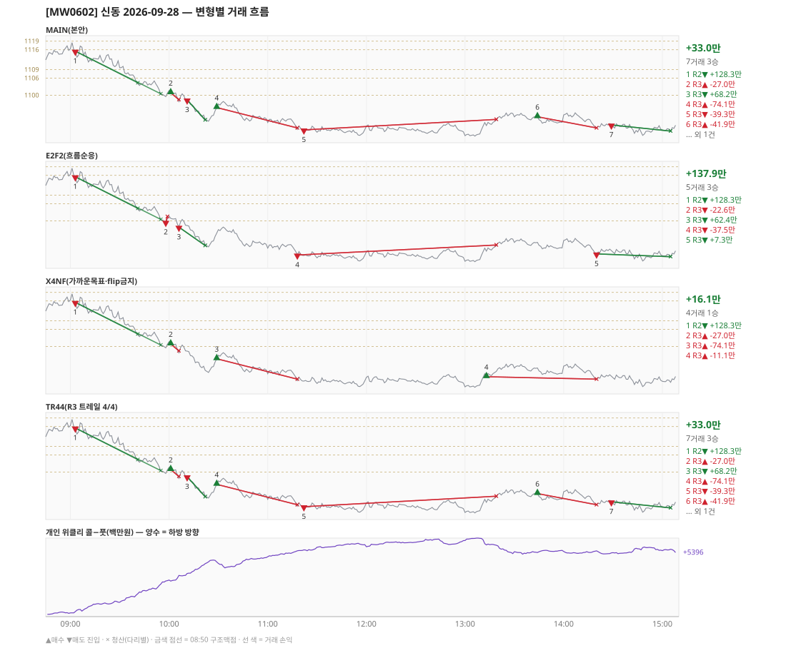

# [MW0602] 신동 일일 리포트 — 2026-09-28

> **MW0602 리포트** · 생성 2026-09-28 18:38 · 규격 `SD-2026-09-24-v1` · 상품 `wk_mon` (최근접 만기 월위클리 (만기 2026-09-28))
> 가상거래다 — 주문 없음(절대원칙 §6). 손익은 미니선물 2계약 · CYBOS 요율 · 1틱 슬리피지 기준.

## 0. 한눈에

| 시장 | R1 장전 | R2 개장확정 | R1 적중(09:00→15:05) |
|---|---|---|---|
| 1116.34 → 1087.40 (-28.94) · 고 1118.92 · 저 1085.32 · 폭 33.6pt | 콜−풋 +279 → **하방** | CONFIRMED 09:03 | ✅ 적중 |

| 변형 | 거래 | 승 | R2 | R3 | **순손익** | 최악 거래 | MAIN 대비 | 기록 |
|---|---|---|---|---|---|---|---|---|
| MAIN(본안) | 7 | 3 | +128.3만 | -95.3만 | **+33.0만** | -74.1만 | — | 라이브 |
| E2F2(흐름순응) | 5 | 3 | +128.3만 | +9.6만 | **+137.9만** | -37.5만 | +104.9만 | 라이브 |
| X4NF(가까운목표·flip금지) | 4 | 1 | +128.3만 | -112.2만 | **+16.1만** | -74.1만 | -16.9만 | 재계산 |
| TR44(R3 트레일 4/4) | 7 | 3 | +128.3만 | -95.3만 | **+33.0만** | -74.1만 | +0.0만 | 재계산 |

**오늘의 한 줄** — MAIN +33.0만(7거래 3승), 최선은 E2F2(흐름순응) +137.9만(MAIN 대비 +104.9만).

> 「재계산」 = 그날 라이브 기록이 없어 엔진으로 다시 돌린 값(같은 엔진·같은 입력). 탐지 시각은 없다.

## 1. 차트

## 2. 거래 흐름 — MAIN

| # | 규칙 | 방향 | 진입 | 맥점 | 손절 | 1차 · 최종 | 청산(다리별) | MFE | 손익 | 누적 |
|---|---|---|---|---|---|---|---|---|---|---|
| 1 | R2 | 매도 | 09:03 1115.50 (탐지 09:04) | - | 1119.92 | 1104.36 · 1100.50 | 1차 09:41 1104.36 · 최종 09:55 1100.50 | 15.7 | **+128.3만** | +128.3만 |
| 2 | R3 | 매수 | 10:01 1100.86 (탐지 10:02) | 1100.0 | 1098.42 | 1118.50 · 1121.50 | 손절 10:06 1098.42 · 손절 10:06 1098.42 | 0.8 | **-27.0만** | +101.4만 |
| 3 | R3 | 매도 | 10:11 1098.36 (탐지 10:12) | 1100.0 | 1101.50 | 1091.30 · 1091.30 | 1차 10:22 1091.30 · 최종 10:22 1091.30 | 7.3 | **+68.2만** | +169.6만 |
| 4 | R3 | 매수 | 10:29 1095.66 (탐지 10:30) | 1090.0 | 1088.50 | 1118.50 · 1121.50 | 손절 11:18 1088.50 · 손절 11:18 1088.50 | 2.8 | **-74.1만** | +95.5만 |
| 5 | R3 | 매도 | 11:22 1087.82 (탐지 11:23) | 1090.0 | 1091.50 | - · - | 손절 13:19 1091.50 · 손절 13:19 1091.50 | 2.5 | **-39.3만** | +56.1만 |
| 6 | R3 | 매수 | 13:44 1092.44 (탐지 13:45) | 1090.0 | 1088.50 | 1118.50 · 1121.50 | 손절 14:20 1088.50 · 손절 14:20 1088.50 | 1.6 | **-41.9만** | +14.2만 |
| 7 | R3 | 매도 | 14:29 1089.54 (탐지 14:30) | 1090.0 | 1091.50 | - · - | 시간 15:05 1087.40 · 시간 15:05 1087.40 | 3.7 | **+18.9만** | +33.0만 |

## 3. 섀도 흐름 — MAIN 과 무엇이 달랐나

### E2F2(흐름순응) — +137.9만 (MAIN 대비 +104.9만)

- 10:01 R3 매수: MAIN 진입 1100.86 → **F2 차단(당일 흐름 역방향)** (MAIN 손익 -27.0만 제외)
- 10:11 R3 매도: MAIN 진입 1098.36 → **앞 거래 보유 중/시점 이동** (MAIN 손익 +68.2만 제외)
- 10:29 R3 매수: MAIN 진입 1095.66 → **F2 차단(당일 흐름 역방향)** (MAIN 손익 -74.1만 제외)
- 11:22 R3 매도: MAIN 진입 1087.82 → **앞 거래 보유 중/시점 이동** (MAIN 손익 -39.3만 제외)
- 13:44 R3 매수: MAIN 진입 1092.44 → **F2 차단(당일 흐름 역방향)** (MAIN 손익 -41.9만 제외)
- 14:29 R3 매도: MAIN 진입 1089.54 → **앞 거래 보유 중/시점 이동** (MAIN 손익 +18.9만 제외)
- 09:58 R3 매도: **섀도만 진입** 1099.50 (앞 거래가 없어 신호가 살아남) → -22.6만
- 10:06 R3 매도: **섀도만 진입** 1097.78 (앞 거래가 없어 신호가 살아남) → +62.4만
- 11:18 R3 매도: **섀도만 진입** 1088.00 (앞 거래가 없어 신호가 살아남) → -37.5만
- 14:20 R3 매도: **섀도만 진입** 1088.38 (앞 거래가 없어 신호가 살아남) → +7.3만

| # | 규칙 | 방향 | 진입 | 맥점 | 손절 | 1차 · 최종 | 청산(다리별) | MFE | 손익 | 누적 |
|---|---|---|---|---|---|---|---|---|---|---|
| 1 | R2 | 매도 | 09:03 1115.50 (탐지 09:04) | - | 1119.92 | 1104.36 · 1100.50 | 1차 09:41 1104.36 · 최종 09:55 1100.50 | 15.7 | **+128.3만** | +128.3만 |
| 2 | R3 | 매도 | 09:58 1099.50 (탐지 09:59) | 1100.0 | 1101.50 | 1091.30 · 1091.30 | 손절 09:59 1101.50 · 손절 09:59 1101.50 | 0.6 | **-22.6만** | +105.8만 |
| 3 | R3 | 매도 | 10:06 1097.78 (탐지 10:07) | 1100.0 | 1101.50 | 1091.30 · 1091.30 | 1차 10:22 1091.30 · 최종 10:22 1091.30 | 6.8 | **+62.4만** | +168.2만 |
| 4 | R3 | 매도 | 11:18 1088.00 (탐지 11:19) | 1090.0 | 1091.50 | - · - | 손절 13:19 1091.50 · 손절 13:19 1091.50 | 2.7 | **-37.5만** | +130.7만 |
| 5 | R3 | 매도 | 14:20 1088.38 (탐지 14:21) | 1090.0 | 1091.50 | - · - | 시간 15:05 1087.40 · 시간 15:05 1087.40 | 2.6 | **+7.3만** | +137.9만 |

### X4NF(가까운목표·flip금지) — +16.1만 (MAIN 대비 -16.9만)

- 10:11 R3 매도: MAIN 진입 1098.36 → **flip 금지(같은 맥점 1100.0 반대 방향)** (MAIN 손익 +68.2만 제외)
- 11:22 R3 매도: MAIN 진입 1087.82 → **flip 금지(같은 맥점 1090.0 반대 방향)** (MAIN 손익 -39.3만 제외)
- 13:44 R3 매수: MAIN 진입 1092.44 → **flip 금지(같은 맥점 1090.0 반대 방향)** (MAIN 손익 -41.9만 제외)
- 14:29 R3 매도: MAIN 진입 1089.54 → **flip 금지(같은 맥점 1090.0 반대 방향)** (MAIN 손익 +18.9만 제외)
- 13:13 R3 매수: **섀도만 진입** 1089.36 (앞 거래가 없어 신호가 살아남) → -11.1만

| # | 규칙 | 방향 | 진입 | 맥점 | 손절 | 1차 · 최종 | 청산(다리별) | MFE | 손익 | 누적 |
|---|---|---|---|---|---|---|---|---|---|---|
| 1 | R2 | 매도 | 09:03 1115.50 | - | 1119.92 | 1104.36 · 1100.50 | 1차 09:41 1104.36 · 최종 09:55 1100.50 | 15.7 | **+128.3만** | +128.3만 |
| 2 | R3 | 매수 | 10:01 1100.86 | 1100.0 | 1098.42 | 1105.50 · 1121.50 | 손절 10:06 1098.42 · 손절 10:06 1098.42 | 0.8 | **-27.0만** | +101.4만 |
| 3 | R3 | 매수 | 10:29 1095.66 | 1090.0 | 1088.50 | 1099.50 · 1121.50 | 손절 11:18 1088.50 · 손절 11:18 1088.50 | 2.8 | **-74.1만** | +27.2만 |
| 4 | R3 | 매수 | 13:13 1089.36 | 1090.0 | 1088.50 | 1099.50 · 1121.50 | 손절 14:20 1088.50 · 손절 14:20 1088.50 | 4.9 | **-11.1만** | +16.1만 |

### TR44(R3 트레일 4/4) — +33.0만 (MAIN 대비 +0.0만)

- MAIN 과 같다

| # | 규칙 | 방향 | 진입 | 맥점 | 손절 | 1차 · 최종 | 청산(다리별) | MFE | 손익 | 누적 |
|---|---|---|---|---|---|---|---|---|---|---|
| 1 | R2 | 매도 | 09:03 1115.50 | - | 1119.92 | 1104.36 · 1100.50 | 1차 09:41 1104.36 · 최종 09:55 1100.50 | 15.7 | **+128.3만** | +128.3만 |
| 2 | R3 | 매수 | 10:01 1100.86 | 1100.0 | 1098.42 | 1118.50 · 1121.50 | 손절 10:06 1098.42 · 손절 10:06 1098.42 | 0.8 | **-27.0만** | +101.4만 |
| 3 | R3 | 매도 | 10:11 1098.36 | 1100.0 | 1101.50 | 1091.30 · 1091.30 | 1차 10:22 1091.30 · 최종 10:22 1091.30 | 7.3 | **+68.2만** | +169.6만 |
| 4 | R3 | 매수 | 10:29 1095.66 | 1090.0 | 1088.50 | 1118.50 · 1121.50 | 손절 11:18 1088.50 · 손절 11:18 1088.50 | 2.8 | **-74.1만** | +95.5만 |
| 5 | R3 | 매도 | 11:22 1087.82 | 1090.0 | 1091.50 | - · - | 손절 13:19 1091.50 · 손절 13:19 1091.50 | 2.5 | **-39.3만** | +56.1만 |
| 6 | R3 | 매수 | 13:44 1092.44 | 1090.0 | 1088.50 | 1118.50 · 1121.50 | 손절 14:20 1088.50 · 손절 14:20 1088.50 | 1.6 | **-41.9만** | +14.2만 |
| 7 | R3 | 매도 | 14:29 1089.54 | 1090.0 | 1091.50 | - · - | 시간 15:05 1087.40 · 시간 15:05 1087.40 | 3.7 | **+18.9만** | +33.0만 |

## 4. 누적 채점 (라이브 기록 · 판정 창)

| 변형 | 채점 시작 | 거래일 | 거래 | 승률 | 순손익 | 최악일 | R3 (건 · 승률 · 순) | 판정 |
|---|---|---|---|---|---|---|---|---|
| MAIN(본안) | 2026-09-28 | 1 | 7 | 43% | **+33.0만** | +33.0만 | 6 · 33% · -95.3만 | R3 중단 판정 1/10일 |
| E2F2(흐름순응) | 2026-09-28 | 1 | 5 | 60% | **+137.9만** | +137.9만 | 4 · 50% · +9.6만 | MAIN 비교 1/10일 |
| X4NF(가까운목표·flip금지) | 2026-09-29 | 0 | - | - | - | - | - | 기록 전 |
| TR44(R3 트레일 4/4) | 2026-09-29 | 0 | - | - | - | - | - | 기록 전 |

> 판정 전 집계다 — 인용·규격 변경 근거로 쓰지 말 것. R3 중단 기준: 순손익 < 0 **그리고** 승률 < 35%.

## 5. 러너 섀도 — 미륵이 × 신동 (CREON 요율)

| 미륵이 진입 | 방향 | 조건 | 러너 | 실제 | 러너 적용 | 차이 | 필터 B |
|---|---|---|---|---|---|---|---|
| 10:53 1092.42 ×2 | 매도 | 충족 | BE 10:55 | +6.3만 | +5.0만 | **-1.3만** | 제외 |
| 11:08 1089.90 ×2 | 매도 | 충족 | TP1 미도달 | -5.0만 | -5.0만 | **+0.0만** | 제외 |
| 11:32 1087.46 ×2 | 매도 | 충족 | TP1 미도달 | -5.1만 | -5.1만 | **+0.0만** | 통과 |

- 합: 실제 -3.8만 → 러너 -5.1만 (차 -1.3만)

## 6. 개선 방향 (자동 관찰 — 판정 아님)

- **진입 품질** — MAIN 손실 4건 중 4건은 유리한 쪽으로 4pt 도 못 갔다(MFE 0.8, 2.8, 2.5, 1.6). 청산을 바꿔서는 못 막는 손실이다 → 진입 필터(E2F2·X4NF) 쪽 관찰 대상.
- **맥점 반복** — 1100.0 에서 R3 2회(매수→매도) · 합 +41.3만. 박스권에서 같은 맥점을 양쪽으로 번갈아 잡았다.
- **맥점 반복** — 1090.0 에서 R3 4회(매수→매도→매수→매도) · 합 -136.6만. 박스권에서 같은 맥점을 양쪽으로 번갈아 잡았다.
- **목표 없는 진입 2건** — 가격이 08:50 맥점 범위 밖이라 손절·15:05 로만 끝날 수 있었다(11:22 -39.3만, 14:29 +18.9만).
- **탐지 지연** — 라이브 진입 7건, 규칙가 대비 실현가능가 차 +0(음수 = 늦게 알아채 손해).
- **오늘 최선은 E2F2(흐름순응)** (+137.9만, MAIN 대비 +104.9만). 하루 결과다 — 판정은 사전등록 창(10거래일)으로만.
- ⚠ 규격 변경은 사전등록 §6(새 버전 · 재채점)으로만. 이 절은 관찰이다.

---
재생성: `python scripts/shindong_daily_report.py 2026-09-28`
