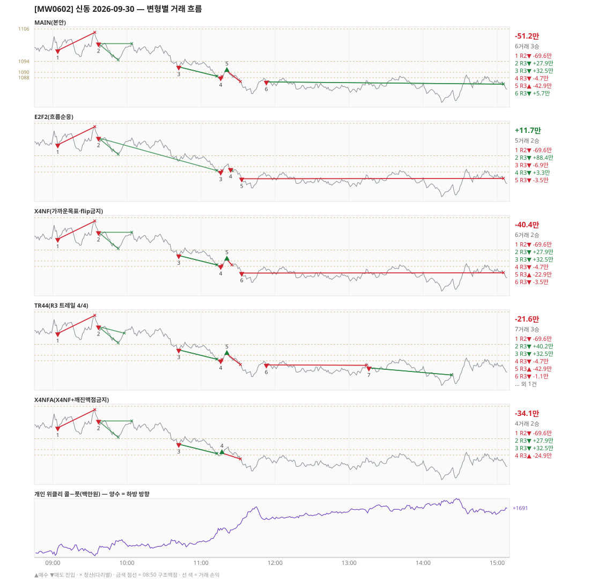

# [MW0602] 신동 일일 리포트 — 2026-09-30

> **MW0602 리포트** · 생성 2026-09-30 15:40 · 규격 `SD-2026-09-24-v1` · 상품 `wk_thu` (최근접 만기 목위클리 (만기 2026-10-01))
> 가상거래다 — 주문 없음(절대원칙 §6). 손익은 미니선물 2계약 · CYBOS 요율 · 1틱 슬리피지 기준.

## 0. 한눈에

| 시장 | R1 장전 | R2 개장확정 | R1 적중(09:00→15:05) |
|---|---|---|---|
| 1100.60 → 1085.62 (-14.98) · 고 1105.20 · 저 1078.70 · 폭 26.5pt | 콜−풋 +211 → **하방** | CONFIRMED 09:04 | ✅ 적중 |

| 변형 | 거래 | 승 | R2 | R3 | **순손익** | 최악 거래 | MAIN 대비 | 기록 |
|---|---|---|---|---|---|---|---|---|
| MAIN(본안) | 6 | 3 | -69.6만 | +18.4만 | **-51.2만** | -69.6만 | — | 라이브 |
| E2F2(흐름순응) | 5 | 2 | -69.6만 | +81.2만 | **+11.7만** | -69.6만 | +62.8만 | 라이브 |
| X4NF(가까운목표·flip금지) | 6 | 2 | -69.6만 | +29.2만 | **-40.4만** | -69.6만 | +10.8만 | 라이브 |
| TR44(R3 트레일 4/4) | 7 | 3 | -69.6만 | +48.0만 | **-21.6만** | -69.6만 | +29.6만 | 라이브 |
| X4NFA(X4NF+깨진맥점금지) | 4 | 2 | -69.6만 | +35.5만 | **-34.1만** | -69.6만 | +17.1만 | 라이브 |

**오늘의 한 줄** — MAIN -51.2만(6거래 3승), 최선은 E2F2(흐름순응) +11.7만(MAIN 대비 +62.8만).

## 1. 차트

## 2. 거래 흐름 — MAIN

| # | 규칙 | 방향 | 진입 | 맥점 | 손절 | 1차 · 최종 | 청산(다리별) | MFE | 손익 | 누적 |
|---|---|---|---|---|---|---|---|---|---|---|
| 1 | R2 | 매도 | 09:04 1098.04 (탐지 09:05) | - | 1104.74 | 1090.23 · 1088.50 | 손절 09:34 1104.74 · 손절 09:34 1104.74 | 2.8 | **-69.6만** | -69.6만 |
| 2 | R3 | 매도 | 09:37 1100.58 (탐지 09:38) | 1104.0 | 1105.50 | 1094.50 · 1088.50 | 1차 09:53 1094.50 · 본전 10:04 1100.58 | 6.5 | **+27.9만** | -41.6만 |
| 3 | R3 | 매도 | 10:42 1091.98 (탐지 10:43) | 1094.0 | 1095.50 | 1088.50 · 1088.50 | 1차 11:13 1088.50 · 최종 11:13 1088.50 | 3.6 | **+32.5만** | -9.2만 |
| 4 | R3 | 매도 | 11:16 1088.04 (탐지 11:17) | 1088.0 | 1089.50 | 1088.50 · 1088.50 | 1차 11:17 1088.50 · 본전 11:17 1088.04 | 0.1 | **-4.7만** | -13.9만 |
| 5 | R3 | 매수 | 11:21 1090.54 (탐지 11:22) | 1088.0 | 1086.50 | 1103.50 · 1115.50 | 손절 11:32 1086.50 · 손절 11:32 1086.50 | 1.0 | **-42.9만** | -56.8만 |
| 6 | R3 | 매도 | 11:53 1086.44 (탐지 11:54) | 1088.0 | 1089.50 | 1078.58 · 1078.58 | 시간 15:05 1085.62 · 시간 15:05 1085.62 | 7.7 | **+5.7만** | -51.2만 |

## 3. 섀도 흐름 — MAIN 과 무엇이 달랐나

### E2F2(흐름순응) — +11.7만 (MAIN 대비 +62.8만)

- 09:37 R3 매도: 청산 차이 — MAIN 1차/본전 → 1차/최종 (+27.9만 → +88.4만, 차 +60.5만)
- 10:42 R3 매도: MAIN 진입 1091.98 → **앞 거래 보유 중/시점 이동** (MAIN 손익 +32.5만 제외)
- 11:16 R3 매도: 청산 차이 — MAIN 1차/본전 → 1차/최종 (-4.7만 → -6.9만, 차 -2.2만)
- 11:21 R3 매수: MAIN 진입 1090.54 → **F2 차단(당일 흐름 역방향)** (MAIN 손익 -42.9만 제외)
- 11:53 R3 매도: MAIN 진입 1086.44 → **앞 거래 보유 중/시점 이동** (MAIN 손익 +5.7만 제외)
- 11:24 R3 매도: **섀도만 진입** 1089.06 (앞 거래가 없어 신호가 살아남) → +3.3만
- 11:33 R3 매도: **섀도만 진입** 1085.52 (앞 거래가 없어 신호가 살아남) → -3.5만

| # | 규칙 | 방향 | 진입 | 맥점 | 손절 | 1차 · 최종 | 청산(다리별) | MFE | 손익 | 누적 |
|---|---|---|---|---|---|---|---|---|---|---|
| 1 | R2 | 매도 | 09:04 1098.04 (탐지 09:05) | - | 1104.74 | 1090.23 · 1088.50 | 손절 09:34 1104.74 · 손절 09:34 1104.74 | 2.8 | **-69.6만** | -69.6만 |
| 2 | R3 | 매도 | 09:37 1100.58 (탐지 09:38) | 1104.0 | 1105.50 | 1094.50 · 1088.50 | 1차 09:53 1094.50 · 최종 11:13 1088.50 | 12.2 | **+88.4만** | +18.9만 |
| 3 | R3 | 매도 | 11:16 1088.04 (탐지 11:17) | 1088.0 | 1089.50 | 1088.50 · 1088.50 | 1차 11:17 1088.50 · 최종 11:17 1088.50 | 0.1 | **-6.9만** | +12.0만 |
| 4 | R3 | 매도 | 11:24 1089.06 (탐지 11:25) | 1090.0 | 1091.86 | 1088.50 · 1088.50 | 1차 11:25 1088.50 · 최종 11:25 1088.50 | 0.6 | **+3.3만** | +15.2만 |
| 5 | R3 | 매도 | 11:33 1085.52 (탐지 11:34) | 1088.0 | 1089.50 | 1078.58 · 1078.58 | 시간 15:05 1085.62 · 시간 15:05 1085.62 | 6.8 | **-3.5만** | +11.7만 |

### X4NF(가까운목표·flip금지) — -40.4만 (MAIN 대비 +10.8만)

- 11:21 R3 매수: 목표가 차이 — 1차 1103.50 → 1093.50 (-42.9만 → -22.9만, 차 +20.0만)
- 11:53 R3 매도: MAIN 진입 1086.44 → **flip 금지(같은 맥점 1088.0 반대 방향)** (MAIN 손익 +5.7만 제외)
- 11:33 R3 매도: **섀도만 진입** 1085.52 (앞 거래가 없어 신호가 살아남) → -3.5만

| # | 규칙 | 방향 | 진입 | 맥점 | 손절 | 1차 · 최종 | 청산(다리별) | MFE | 손익 | 누적 |
|---|---|---|---|---|---|---|---|---|---|---|
| 1 | R2 | 매도 | 09:04 1098.04 (탐지 09:05) | - | 1104.74 | 1090.23 · 1088.50 | 손절 09:34 1104.74 · 손절 09:34 1104.74 | 2.8 | **-69.6만** | -69.6만 |
| 2 | R3 | 매도 | 09:37 1100.58 (탐지 09:38) | 1104.0 | 1105.50 | 1094.50 · 1088.50 | 1차 09:53 1094.50 · 본전 10:04 1100.58 | 6.5 | **+27.9만** | -41.6만 |
| 3 | R3 | 매도 | 10:42 1091.98 (탐지 10:43) | 1094.0 | 1095.50 | 1088.50 · 1088.50 | 1차 11:13 1088.50 · 최종 11:13 1088.50 | 3.6 | **+32.5만** | -9.2만 |
| 4 | R3 | 매도 | 11:16 1088.04 (탐지 11:17) | 1088.0 | 1089.50 | 1088.50 · 1088.50 | 1차 11:17 1088.50 · 본전 11:17 1088.04 | 0.1 | **-4.7만** | -13.9만 |
| 5 | R3 | 매수 | 11:21 1090.54 (탐지 11:22) | 1090.0 | 1088.50 | 1093.50 · 1115.50 | 손절 11:25 1088.50 · 손절 11:25 1088.50 | 1.0 | **-22.9만** | -36.8만 |
| 6 | R3 | 매도 | 11:33 1085.52 (탐지 11:34) | 1088.0 | 1089.50 | 1078.58 · 1078.58 | 시간 15:05 1085.62 · 시간 15:05 1085.62 | 6.8 | **-3.5만** | -40.4만 |

### TR44(R3 트레일 4/4) — -21.6만 (MAIN 대비 +29.6만)

- 09:37 R3 매도: 청산 차이 — MAIN 1차/본전 → 1차/트레일 (+27.9만 → +40.2만, 차 +12.3만)
- 11:53 R3 매도: 청산 차이 — MAIN 시간/시간 → 트레일/트레일 (+5.7만 → -1.1만, 차 -6.8만)
- 13:16 R3 매도: **섀도만 진입** 1085.36 (앞 거래가 없어 신호가 살아남) → +24.1만

| # | 규칙 | 방향 | 진입 | 맥점 | 손절 | 1차 · 최종 | 청산(다리별) | MFE | 손익 | 누적 |
|---|---|---|---|---|---|---|---|---|---|---|
| 1 | R2 | 매도 | 09:04 1098.04 (탐지 09:05) | - | 1104.74 | 1090.23 · 1088.50 | 손절 09:34 1104.74 · 손절 09:34 1104.74 | 2.8 | **-69.6만** | -69.6만 |
| 2 | R3 | 매도 | 09:37 1100.58 (탐지 09:38) | 1104.0 | 1105.50 | 1094.50 · 1088.50 | 1차 09:53 1094.50 · 트레일 09:58 1098.12 | 6.5 | **+40.2만** | -29.3만 |
| 3 | R3 | 매도 | 10:42 1091.98 (탐지 10:43) | 1094.0 | 1095.50 | 1088.50 · 1088.50 | 1차 11:13 1088.50 · 최종 11:13 1088.50 | 3.6 | **+32.5만** | +3.1만 |
| 4 | R3 | 매도 | 11:16 1088.04 (탐지 11:17) | 1088.0 | 1089.50 | 1088.50 · 1088.50 | 1차 11:17 1088.50 · 본전 11:17 1088.04 | 0.1 | **-4.7만** | -1.6만 |
| 5 | R3 | 매수 | 11:21 1090.54 (탐지 11:22) | 1088.0 | 1086.50 | 1103.50 · 1115.50 | 손절 11:32 1086.50 · 손절 11:32 1086.50 | 1.0 | **-42.9만** | -44.5만 |
| 6 | R3 | 매도 | 11:53 1086.44 (탐지 11:54) | 1088.0 | 1089.50 | 1078.58 · 1078.58 | 트레일 13:14 1086.30 · 트레일 13:14 1086.30 | 4.1 | **-1.1만** | -45.7만 |
| 7 | R3 | 매도 | 13:16 1085.36 (탐지 13:17) | 1088.0 | 1089.50 | 1078.58 · 1078.58 | 트레일 14:23 1082.70 · 트레일 14:23 1082.70 | 6.7 | **+24.1만** | -21.6만 |

### X4NFA(X4NF+깨진맥점금지) — -34.1만 (MAIN 대비 +17.1만)

- 11:16 R3 매도: MAIN 진입 1088.04 → **깨진 맥점 차단(진입 1088.04 · 맥점 1088.0)** (MAIN 손익 -4.7만 제외)
- 11:21 R3 매수: MAIN 진입 1090.54 → **flip 금지(같은 맥점 1088.0 반대 방향)** (MAIN 손익 -42.9만 제외)
- 11:53 R3 매도: MAIN 진입 1086.44 → **flip 금지(같은 맥점 1088.0 반대 방향)** (MAIN 손익 +5.7만 제외)
- 11:17 R3 매수: **섀도만 진입** 1088.74 (앞 거래가 없어 신호가 살아남) → -24.9만

| # | 규칙 | 방향 | 진입 | 맥점 | 손절 | 1차 · 최종 | 청산(다리별) | MFE | 손익 | 누적 |
|---|---|---|---|---|---|---|---|---|---|---|
| 1 | R2 | 매도 | 09:04 1098.04 (탐지 09:05) | - | 1104.74 | 1090.23 · 1088.50 | 손절 09:34 1104.74 · 손절 09:34 1104.74 | 2.8 | **-69.6만** | -69.6만 |
| 2 | R3 | 매도 | 09:37 1100.58 (탐지 09:38) | 1104.0 | 1105.50 | 1094.50 · 1088.50 | 1차 09:53 1094.50 · 본전 10:04 1100.58 | 6.5 | **+27.9만** | -41.6만 |
| 3 | R3 | 매도 | 10:42 1091.98 (탐지 10:43) | 1094.0 | 1095.50 | 1088.50 · 1088.50 | 1차 11:13 1088.50 · 최종 11:13 1088.50 | 3.6 | **+32.5만** | -9.2만 |
| 4 | R3 | 매수 | 11:17 1088.74 (탐지 11:18) | 1088.0 | 1086.50 | 1093.50 · 1115.50 | 손절 11:32 1086.50 · 손절 11:32 1086.50 | 2.8 | **-24.9만** | -34.1만 |

## 4. 누적 채점 (라이브 기록 · 판정 창)

| 변형 | 채점 시작 | 거래일 | 거래 | 승률 | 순손익 | 최악일 | R3 (건 · 승률 · 순) | 판정 |
|---|---|---|---|---|---|---|---|---|
| MAIN(본안) | 2026-09-28 | 3 | 20 | 35% | **-121.9만** | -103.8만 | 18 · 33% · -180.7만 | R3 중단 판정 3/10일 |
| E2F2(흐름순응) | 2026-09-28 | 3 | 21 | 29% | **-104.6만** | -254.2만 | 19 · 26% · -163.4만 | MAIN 비교 3/10일 |
| X4NF(가까운목표·flip금지) | 2026-09-29 | 2 | 13 | 38% | **-96.9만** | -56.5만 | 12 · 42% · -27.3만 | MAIN 비교 2/10일 |
| TR44(R3 트레일 4/4) | 2026-09-29 | 2 | 16 | 31% | **-164.7만** | -143.1만 | 15 · 33% · -95.1만 | MAIN 비교 2/10일 |
| X4NFA(X4NF+깨진맥점금지) | 2026-09-30 | 1 | 4 | 50% | **-34.1만** | -34.1만 | 3 · 67% · +35.5만 | MAIN 비교 1/10일 |

> 판정 전 집계다 — 인용·규격 변경 근거로 쓰지 말 것. R3 중단 기준: 순손익 < 0 **그리고** 승률 < 35%.

## 5. 러너 섀도 — 미륵이 × 신동 (CREON 요율)

- 오늘 기록 없음 — 미륵이 시스템 진입이 없었거나 장후 기록 전이다

## 6. 개선 방향 (자동 관찰 — 판정 아님)

- **진입 품질** — MAIN 손실 3건 중 3건은 유리한 쪽으로 4pt 도 못 갔다(MFE 2.8, 0.1, 1.0). 청산을 바꿔서는 못 막는 손실이다 → 진입 필터(E2F2·X4NF·X4NFA) 쪽 관찰 대상.
- **맥점 반복** — 1088.0 에서 R3 3회(매도→매수→매도) · 합 -42.0만. 박스권에서 같은 맥점을 양쪽으로 번갈아 잡았다.
- **깨진 맥점 진입 1건** — 흐름 반전을 기다리는 사이 가격이 맥점을 다시 넘어간 뒤 들어갔다(11:16 매도 1088.04/맥점 1088.0 -4.7만) · 합 -4.7만 → X4NFA 가 막는 진입이다.
- **탐지 지연** — 라이브 진입 6건, 규칙가 대비 실현가능가 차 +0(음수 = 늦게 알아채 손해).
- **오늘 최선은 E2F2(흐름순응)** (+11.7만, MAIN 대비 +62.8만). 하루 결과다 — 판정은 사전등록 창(10거래일)으로만.
- ⚠ 규격 변경은 사전등록 §6(새 버전 · 재채점)으로만. 이 절은 관찰이다.

---
재생성: `python scripts/shindong_daily_report.py 2026-09-30`
