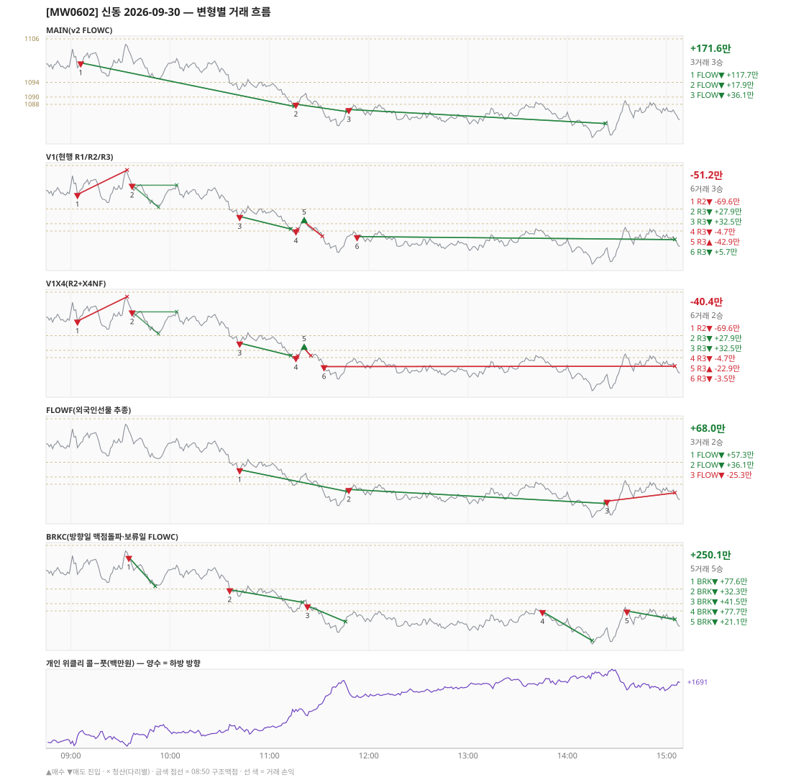

# [MW0602] 신동 일일 리포트 — 2026-09-30

> **MW0602 리포트** · 생성 2026-09-30 20:33 · 규격 `SD-2026-09-30-v2.1` · 상품 `wk_thu` (최근접 만기 목위클리 (만기 2026-10-01))
> 가상거래다 — 주문 없음(절대원칙 §6). 손익은 미니선물 2계약 · CYBOS 요율 · 1틱 슬리피지 기준.

## 0. 한눈에

| 시장 | R1 장전 | R2 개장확정(V1) | R1 적중(09:00→15:05) |
|---|---|---|---|
| 1100.60 → 1085.62 (-14.98) · 고 1105.20 · 저 1078.70 · 폭 26.5pt | 콜−풋 +211 → **하방** | CONFIRMED 09:04 | ✅ 적중 |

| 변형 | 거래 | 승 | 규칙별 | **순손익** | 최악 거래 | MAIN 대비 | 기록 |
|---|---|---|---|---|---|---|---|
| MAIN(v2 FLOWC) | 3 | 3 | FLOW +171.6만 | **+171.6만** | +17.9만 | — | 라이브 |
| V1(현행 R1/R2/R3) | 6 | 3 | R2 -69.6만 · R3 +18.4만 | **-51.2만** | -69.6만 | -222.8만 | 재계산 |
| V1X4(R2+X4NF) | 6 | 2 | R2 -69.6만 · R3 +29.2만 | **-40.4만** | -69.6만 | -212.0만 | 재계산 |
| FLOWF(외국인선물 추종) | 3 | 2 | FLOW +68.0만 | **+68.0만** | -25.3만 | -103.6만 | 재계산 |
| BRKC(방향일 맥점돌파·보류일 FLOWC) | 5 | 5 | BRK +250.1만 | **+250.1만** | +21.1만 | +78.5만 | 재계산 |

**오늘의 한 줄** — MAIN +171.6만(3거래 3승), 최선은 BRKC(방향일 맥점돌파·보류일 FLOWC) +250.1만(MAIN 대비 +78.5만).

> 「재계산」 = 그날 라이브 기록이 없어 엔진으로 다시 돌린 값(같은 엔진·같은 입력). 탐지 시각은 없다.

## 1. 차트

## 2. 거래 흐름 — MAIN

| # | 규칙 | 방향 | 진입 | 맥점 | 손절 | 1차 · 최종 | 청산(다리별) | MFE | 손익 | 누적 |
|---|---|---|---|---|---|---|---|---|---|---|
| 1 | FLOW | 매도 | 09:06 1099.40 | - | 1117.68 | 1087.40 · 1087.40 | 1차 11:15 1087.40 · 최종 11:15 1087.40 | 12.1 | **+117.7만** | +117.7만 |
| 2 | FLOW | 매도 | 11:16 1088.04 | - | 1106.32 | 1076.04 · 1076.04 | 트레일 11:47 1086.00 · 트레일 11:47 1086.00 | 6.0 | **+17.9만** | +135.5만 |
| 3 | FLOW | 매도 | 11:48 1086.56 | - | 1104.84 | 1074.56 · 1074.56 | 트레일 14:23 1082.70 · 트레일 14:23 1082.70 | 7.9 | **+36.1만** | +171.6만 |

## 3. 섀도 흐름 — 변형별 거래(v1 계열은 V1 과 무엇이 달랐나)

### V1(현행 R1/R2/R3) — -51.2만 (MAIN 대비 -222.8만)

- v1(R1/R2/R3) 대조군 — 되돌림 판정의 기준. 아래 v1 계열 섀도는 이 거래와 대조한다

| # | 규칙 | 방향 | 진입 | 맥점 | 손절 | 1차 · 최종 | 청산(다리별) | MFE | 손익 | 누적 |
|---|---|---|---|---|---|---|---|---|---|---|
| 1 | R2 | 매도 | 09:04 1098.04 | - | 1104.74 | 1090.23 · 1088.50 | 손절 09:34 1104.74 · 손절 09:34 1104.74 | 2.8 | **-69.6만** | -69.6만 |
| 2 | R3 | 매도 | 09:37 1100.58 | 1104.0 | 1105.50 | 1094.50 · 1088.50 | 1차 09:53 1094.50 · 본전 10:04 1100.58 | 6.5 | **+27.9만** | -41.6만 |
| 3 | R3 | 매도 | 10:42 1091.98 | 1094.0 | 1095.50 | 1088.50 · 1088.50 | 1차 11:13 1088.50 · 최종 11:13 1088.50 | 3.6 | **+32.5만** | -9.2만 |
| 4 | R3 | 매도 | 11:16 1088.04 | 1088.0 | 1089.50 | 1088.50 · 1088.50 | 1차 11:17 1088.50 · 본전 11:17 1088.04 | 0.1 | **-4.7만** | -13.9만 |
| 5 | R3 | 매수 | 11:21 1090.54 | 1088.0 | 1086.50 | 1103.50 · 1115.50 | 손절 11:32 1086.50 · 손절 11:32 1086.50 | 1.0 | **-42.9만** | -56.8만 |
| 6 | R3 | 매도 | 11:53 1086.44 | 1088.0 | 1089.50 | 1078.58 · 1078.58 | 시간 15:05 1085.62 · 시간 15:05 1085.62 | 7.7 | **+5.7만** | -51.2만 |

### V1X4(R2+X4NF) — -40.4만 (MAIN 대비 -212.0만)

- 11:21 R3 매수: 목표가 차이 — 1차 1103.50 → 1093.50 (-42.9만 → -22.9만, 차 +20.0만)
- 11:53 R3 매도: V1 진입 1086.44 → **flip 금지(같은 맥점 1088.0 반대 방향)** (V1 손익 +5.7만 제외)
- 11:33 R3 매도: **섀도만 진입** 1085.52 (앞 거래가 없어 신호가 살아남) → -3.5만

| # | 규칙 | 방향 | 진입 | 맥점 | 손절 | 1차 · 최종 | 청산(다리별) | MFE | 손익 | 누적 |
|---|---|---|---|---|---|---|---|---|---|---|
| 1 | R2 | 매도 | 09:04 1098.04 | - | 1104.74 | 1090.23 · 1088.50 | 손절 09:34 1104.74 · 손절 09:34 1104.74 | 2.8 | **-69.6만** | -69.6만 |
| 2 | R3 | 매도 | 09:37 1100.58 | 1104.0 | 1105.50 | 1094.50 · 1088.50 | 1차 09:53 1094.50 · 본전 10:04 1100.58 | 6.5 | **+27.9만** | -41.6만 |
| 3 | R3 | 매도 | 10:42 1091.98 | 1094.0 | 1095.50 | 1088.50 · 1088.50 | 1차 11:13 1088.50 · 최종 11:13 1088.50 | 3.6 | **+32.5만** | -9.2만 |
| 4 | R3 | 매도 | 11:16 1088.04 | 1088.0 | 1089.50 | 1088.50 · 1088.50 | 1차 11:17 1088.50 · 본전 11:17 1088.04 | 0.1 | **-4.7만** | -13.9만 |
| 5 | R3 | 매수 | 11:21 1090.54 | 1090.0 | 1088.50 | 1093.50 · 1115.50 | 손절 11:25 1088.50 · 손절 11:25 1088.50 | 1.0 | **-22.9만** | -36.8만 |
| 6 | R3 | 매도 | 11:33 1085.52 | 1088.0 | 1089.50 | 1078.58 · 1078.58 | 시간 15:05 1085.62 · 시간 15:05 1085.62 | 6.8 | **-3.5만** | -40.4만 |

### FLOWF(외국인선물 추종) — +68.0만 (MAIN 대비 -103.6만)

- 별개 규칙(family) — MAIN·V1 과 거래 단위 대조는 하지 않는다. 손익·최악·거래 수로만 비교

| # | 규칙 | 방향 | 진입 | 맥점 | 손절 | 1차 · 최종 | 청산(다리별) | MFE | 손익 | 누적 |
|---|---|---|---|---|---|---|---|---|---|---|
| 1 | FLOW | 매도 | 10:42 1091.98 | - | 1110.26 | 1079.98 · 1079.98 | 트레일 11:47 1086.00 · 트레일 11:47 1086.00 | 10.0 | **+57.3만** | +57.3만 |
| 2 | FLOW | 매도 | 11:48 1086.56 | - | 1104.84 | 1074.56 · 1074.56 | 트레일 14:23 1082.70 · 트레일 14:23 1082.70 | 7.9 | **+36.1만** | +93.3만 |
| 3 | FLOW | 매도 | 14:24 1083.34 | - | 1101.62 | 1071.34 · 1071.34 | 시간 15:05 1085.62 · 시간 15:05 1085.62 | 4.1 | **-25.3만** | +68.0만 |

### BRKC(방향일 맥점돌파·보류일 FLOWC) — +250.1만 (MAIN 대비 +78.5만)

- 별개 규칙(family) — MAIN·V1 과 거래 단위 대조는 하지 않는다. 손익·최악·거래 수로만 비교

| # | 규칙 | 방향 | 진입 | 맥점 | 손절 | 1차 · 최종 | 청산(다리별) | MFE | 손익 | 누적 |
|---|---|---|---|---|---|---|---|---|---|---|
| 1 | BRK | 매도 | 09:35 1102.74 | 1104.0 | 1106.00 | 1094.74 · 1094.74 | 1차 09:51 1094.74 · 최종 09:51 1094.74 | 8.2 | **+77.6만** | +77.6만 |
| 2 | BRK | 매도 | 10:36 1093.82 | 1094.0 | 1096.00 | 1085.82 · 1085.82 | 트레일 11:20 1090.34 · 트레일 11:20 1090.34 | 6.5 | **+32.3만** | +109.9만 |
| 3 | BRK | 매도 | 11:23 1089.40 | 1090.0 | 1092.00 | 1081.40 · 1081.40 | 트레일 11:46 1085.00 · 트레일 11:46 1085.00 | 7.4 | **+41.5만** | +151.4만 |
| 4 | BRK | 매도 | 13:45 1087.82 | 1088.0 | 1090.00 | 1079.82 · 1079.82 | 1차 14:15 1079.82 · 최종 14:15 1079.82 | 9.1 | **+77.7만** | +229.0만 |
| 5 | BRK | 매도 | 14:36 1087.98 | 1088.0 | 1090.00 | 1079.98 · 1079.98 | 시간 15:05 1085.62 · 시간 15:05 1085.62 | 4.1 | **+21.1만** | +250.1만 |

## 4. 누적 채점 (라이브 기록 · 판정 창)

| 변형 | 채점 시작 | 거래일 | 거래 | 승률 | 순손익 | 최악일 | R3 (건 · 승률 · 순) | 판정 |
|---|---|---|---|---|---|---|---|---|
| MAIN(v2 FLOWC) | 2026-10-01 | 0 | - | - | - | - | - | 기록 전 |
| V1(현행 R1/R2/R3) | 2026-10-01 | 0 | - | - | - | - | - | 기록 전 |
| V1X4(R2+X4NF) | 2026-10-01 | 0 | - | - | - | - | - | 기록 전 |
| FLOWF(외국인선물 추종) | 2026-10-01 | 0 | - | - | - | - | - | 기록 전 |
| BRKC(방향일 맥점돌파·보류일 FLOWC) | 2026-10-01 | 0 | - | - | - | - | - | 기록 전 |

> 판정 전 집계다 — 인용·규격 변경 근거로 쓰지 말 것. 되돌림: V1 이 MAIN 보다 순손익·최악일 **둘 다** 나으면 v1 복귀. 섀도: MAIN 대비 순손익 우위 **그리고** 최악일 개선 → 채택 후보(자동 승격 없음).

## 5. 러너 섀도 — 미륵이 × 신동 (CREON 요율)

- 오늘 기록 없음 — 미륵이 시스템 진입이 없었거나 장후 기록 전이다

## 6. 개선 방향 (자동 관찰 — 판정 아님)

- **오늘 최선은 BRKC(방향일 맥점돌파·보류일 FLOWC)** (+250.1만, MAIN 대비 +78.5만). 하루 결과다 — 판정은 사전등록 창(20거래일)으로만.
- **v1 대조** — V1 -51.2만 vs MAIN +171.6만 (차 +222.8만). 되돌림 판정은 20거래일 누적으로만.
- ⚠ 규격 변경은 사전등록 §6(새 버전 · 재채점)으로만. 이 절은 관찰이다.

---
재생성: `python scripts/shindong_daily_report.py 2026-09-30`
