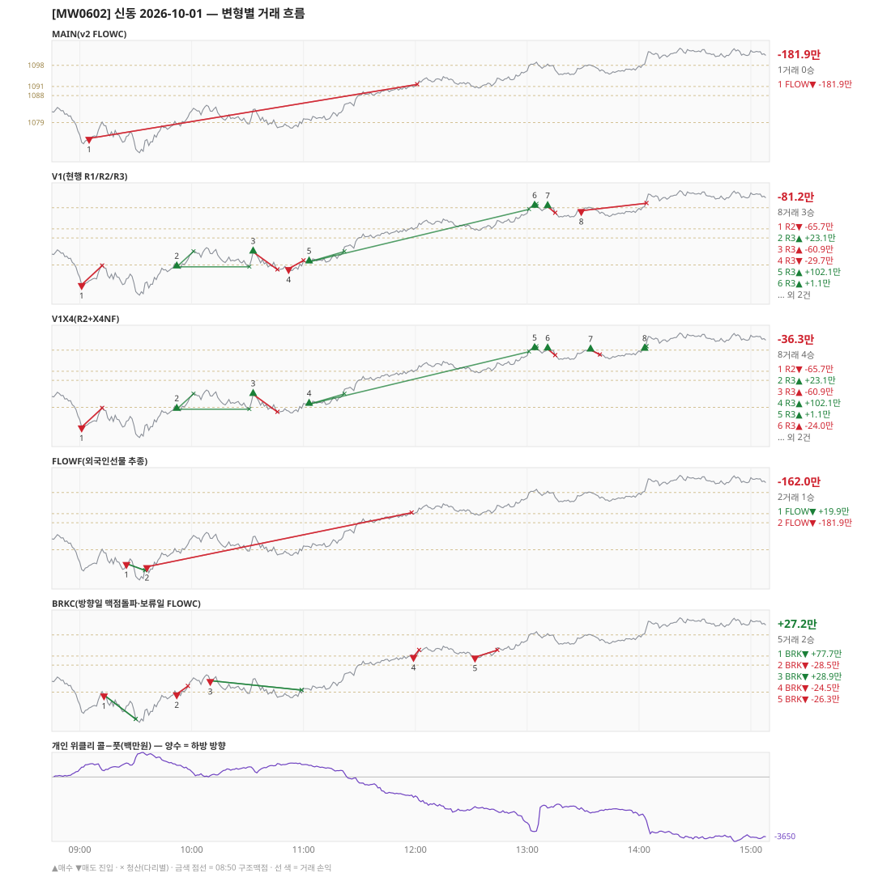

# [MW0602] 신동 일일 리포트 — 2026-10-01

> **MW0602 리포트** · 생성 2026-10-01 15:40 · 규격 `SD-2026-09-30-v2.1` · 상품 `wk_thu` (최근접 만기 목위클리 (만기 2026-10-01))
> 가상거래다 — 주문 없음(절대원칙 §6). 손익은 미니선물 2계약 · CYBOS 요율 · 1틱 슬리피지 기준.

## 0. 한눈에

| 시장 | R1 장전 | R2 개장확정(V1) | R1 적중(09:00→15:05) |
|---|---|---|---|
| 1074.88 → 1102.58 (+27.70) · 고 1104.12 · 저 1068.16 · 폭 36.0pt | 콜−풋 +343 → **하방** | CONFIRMED 09:01 | ❌ 불적중 |

| 변형 | 거래 | 승 | 규칙별 | **순손익** | 최악 거래 | MAIN 대비 | 기록 |
|---|---|---|---|---|---|---|---|
| MAIN(v2 FLOWC) | 1 | 0 | FLOW -181.9만 | **-181.9만** | -181.9만 | — | 라이브 |
| V1(현행 R1/R2/R3) | 8 | 3 | R2 -65.7만 · R3 -15.5만 | **-81.2만** | -65.7만 | +100.6만 | 라이브 |
| V1X4(R2+X4NF) | 8 | 4 | R2 -65.7만 · R3 +29.5만 | **-36.3만** | -65.7만 | +145.6만 | 라이브 |
| FLOWF(외국인선물 추종) | 2 | 1 | FLOW -162.0만 | **-162.0만** | -181.9만 | +19.9만 | 라이브 |
| BRKC(방향일 맥점돌파·보류일 FLOWC) | 5 | 2 | BRK +27.2만 | **+27.2만** | -28.5만 | +209.1만 | 라이브 |

**오늘의 한 줄** — MAIN -181.9만(1거래 0승), 최선은 BRKC(방향일 맥점돌파·보류일 FLOWC) +27.2만(MAIN 대비 +209.1만).

## 1. 차트

## 2. 거래 흐름 — MAIN

| # | 규칙 | 방향 | 진입 | 맥점 | 손절 | 1차 · 최종 | 청산(다리별) | MFE | 손익 | 누적 |
|---|---|---|---|---|---|---|---|---|---|---|
| 1 | FLOW | 매도 | 09:05 1073.76 (탐지 09:06) | - | 1091.70 | 1061.76 · 1061.76 | 손절 12:01 1091.70 · 손절 12:01 1091.70 | 5.6 | **-181.9만** | -181.9만 |

## 3. 섀도 흐름 — 변형별 거래(v1 계열은 V1 과 무엇이 달랐나)

### V1(현행 R1/R2/R3) — -81.2만 (MAIN 대비 +100.6만)

- v1(R1/R2/R3) 대조군 — 되돌림 판정의 기준. 아래 v1 계열 섀도는 이 거래와 대조한다

| # | 규칙 | 방향 | 진입 | 맥점 | 손절 | 1차 · 최종 | 청산(다리별) | MFE | 손익 | 누적 |
|---|---|---|---|---|---|---|---|---|---|---|
| 1 | R2 | 매도 | 09:01 1072.46 (탐지 09:02) | - | 1078.78 | 1062.66 · 1062.66 | 손절 09:12 1078.78 · 손절 09:12 1078.78 | 1.0 | **-65.7만** | -65.7만 |
| 2 | R3 | 매수 | 09:52 1078.40 (탐지 09:53) | 1079.0 | 1077.00 | 1083.50 · 1097.50 | 1차 10:01 1083.50 · 본전 10:31 1078.40 | 6.8 | **+23.1만** | -42.6만 |
| 3 | R3 | 매수 | 10:33 1083.34 (탐지 10:34) | 1079.0 | 1077.50 | 1097.50 · 1097.50 | 손절 10:46 1077.50 · 손절 10:46 1077.50 | 1.0 | **-60.9만** | -103.5만 |
| 4 | R3 | 매도 | 10:52 1077.78 (탐지 10:53) | 1079.0 | 1080.50 | 1062.66 · 1059.49 | 손절 11:00 1080.50 · 손절 11:00 1080.50 | 1.1 | **-29.7만** | -133.3만 |
| 5 | R3 | 매수 | 11:03 1080.06 (탐지 11:04) | 1079.0 | 1077.50 | 1083.50 · 1097.50 | 1차 11:22 1083.50 · 최종 13:01 1097.50 | 17.9 | **+102.1만** | -31.2만 |
| 6 | R3 | 매수 | 13:04 1098.54 (탐지 13:05) | 1098.0 | 1096.50 | 1099.24 · 1099.24 | 1차 13:05 1099.24 · 본전 13:05 1098.54 | 0.8 | **+1.1만** | -30.1만 |
| 7 | R3 | 매수 | 13:11 1098.44 (탐지 13:12) | 1098.0 | 1096.30 | 1099.24 · 1099.24 | 손절 13:15 1096.30 · 손절 13:15 1096.30 | 0.2 | **-24.0만** | -54.1만 |
| 8 | R3 | 매도 | 13:29 1097.04 (탐지 13:30) | 1098.0 | 1099.50 | 1079.50 · 1059.49 | 손절 14:04 1099.50 · 손절 14:04 1099.50 | 2.0 | **-27.2만** | -81.2만 |

### V1X4(R2+X4NF) — -36.3만 (MAIN 대비 +145.6만)

- 10:52 R3 매도: V1 진입 1077.78 → **flip 금지(같은 맥점 1079.0 반대 방향)** (V1 손익 -29.7만 제외)
- 13:29 R3 매도: V1 진입 1097.04 → **flip 금지(같은 맥점 1098.0 반대 방향)** (V1 손익 -27.2만 제외)
- 13:34 R3 매수: **섀도만 진입** 1098.08 (앞 거래가 없어 신호가 살아남) → -18.4만
- 14:03 R3 매수: **섀도만 진입** 1098.36 (앞 거래가 없어 신호가 살아남) → +6.5만

| # | 규칙 | 방향 | 진입 | 맥점 | 손절 | 1차 · 최종 | 청산(다리별) | MFE | 손익 | 누적 |
|---|---|---|---|---|---|---|---|---|---|---|
| 1 | R2 | 매도 | 09:01 1072.46 (탐지 09:02) | - | 1078.78 | 1062.66 · 1062.66 | 손절 09:12 1078.78 · 손절 09:12 1078.78 | 1.0 | **-65.7만** | -65.7만 |
| 2 | R3 | 매수 | 09:52 1078.40 (탐지 09:53) | 1079.0 | 1077.00 | 1083.50 · 1097.50 | 1차 10:01 1083.50 · 본전 10:31 1078.40 | 6.8 | **+23.1만** | -42.6만 |
| 3 | R3 | 매수 | 10:33 1083.34 (탐지 10:34) | 1079.0 | 1077.50 | 1087.50 · 1097.50 | 손절 10:46 1077.50 · 손절 10:46 1077.50 | 1.0 | **-60.9만** | -103.5만 |
| 4 | R3 | 매수 | 11:03 1080.06 (탐지 11:04) | 1079.0 | 1077.50 | 1083.50 · 1097.50 | 1차 11:22 1083.50 · 최종 13:01 1097.50 | 17.9 | **+102.1만** | -1.5만 |
| 5 | R3 | 매수 | 13:04 1098.54 (탐지 13:05) | 1098.0 | 1096.50 | 1099.24 · 1099.24 | 1차 13:05 1099.24 · 본전 13:05 1098.54 | 0.8 | **+1.1만** | -0.4만 |
| 6 | R3 | 매수 | 13:11 1098.44 (탐지 13:12) | 1098.0 | 1096.30 | 1099.24 · 1099.24 | 손절 13:15 1096.30 · 손절 13:15 1096.30 | 0.2 | **-24.0만** | -24.4만 |
| 7 | R3 | 매수 | 13:34 1098.08 (탐지 13:35) | 1098.0 | 1096.50 | 1099.24 · 1099.24 | 손절 13:39 1096.50 · 손절 13:39 1096.50 | 0.0 | **-18.4만** | -42.7만 |
| 8 | R3 | 매수 | 14:03 1098.36 (탐지 14:04) | 1098.0 | 1096.50 | 1099.24 · 1099.24 | 1차 14:04 1099.24 · 최종 14:04 1099.24 | 2.1 | **+6.5만** | -36.3만 |

### FLOWF(외국인선물 추종) — -162.0만 (MAIN 대비 +19.9만)

- 별개 규칙(family) — MAIN·V1 과 거래 단위 대조는 하지 않는다. 손익·최악·거래 수로만 비교

| # | 규칙 | 방향 | 진입 | 맥점 | 손절 | 1차 · 최종 | 청산(다리별) | MFE | 손익 | 누적 |
|---|---|---|---|---|---|---|---|---|---|---|
| 1 | FLOW | 매도 | 09:25 1074.40 (탐지 09:26) | - | 1092.34 | 1062.40 · 1062.40 | 트레일 09:35 1072.16 · 트레일 09:35 1072.16 | 6.2 | **+19.9만** | +19.9만 |
| 2 | FLOW | 매도 | 09:36 1073.38 (탐지 09:37) | - | 1091.32 | 1061.38 · 1061.38 | 손절 11:58 1091.32 · 손절 11:58 1091.32 | 2.5 | **-181.9만** | -162.0만 |

### BRKC(방향일 맥점돌파·보류일 FLOWC) — +27.2만 (MAIN 대비 +209.1만)

- 별개 규칙(family) — MAIN·V1 과 거래 단위 대조는 하지 않는다. 손익·최악·거래 수로만 비교

| # | 규칙 | 방향 | 진입 | 맥점 | 손절 | 1차 · 최종 | 청산(다리별) | MFE | 손익 | 누적 |
|---|---|---|---|---|---|---|---|---|---|---|
| 1 | BRK | 매도 | 09:13 1078.06 (탐지 09:14) | 1079.0 | 1081.00 | 1070.06 · 1070.06 | 1차 09:30 1070.06 · 최종 09:30 1070.06 | 8.2 | **+77.7만** | +77.7만 |
| 2 | BRK | 매도 | 09:52 1078.40 (탐지 09:53) | 1079.0 | 1081.00 | 1070.40 · 1070.40 | 손절 09:58 1081.00 · 손절 09:58 1081.00 | 0.9 | **-28.5만** | +49.2만 |
| 3 | BRK | 매도 | 10:10 1082.84 (탐지 10:11) | 1084.0 | 1086.00 | 1074.84 · 1074.84 | 트레일 10:59 1079.70 · 트레일 10:59 1079.70 | 6.1 | **+28.9만** | +78.1만 |
| 4 | BRK | 매도 | 11:59 1090.80 (탐지 12:00) | 1091.0 | 1093.00 | 1082.80 · 1082.80 | 손절 12:02 1093.00 · 손절 12:02 1093.00 | 0.6 | **-24.5만** | +53.5만 |
| 5 | BRK | 매도 | 12:32 1090.62 (탐지 12:33) | 1091.0 | 1093.00 | 1082.62 · 1082.62 | 손절 12:44 1093.00 · 손절 12:44 1093.00 | 0.5 | **-26.3만** | +27.2만 |

## 4. 누적 채점 (라이브 기록 · 판정 창)

| 변형 | 채점 시작 | 거래일 | 거래 | 승률 | 순손익 | 최악일 | R3 (건 · 승률 · 순) | 판정 |
|---|---|---|---|---|---|---|---|---|
| MAIN(v2 FLOWC) | 2026-10-01 | 1 | 1 | 0% | **-181.9만** | -181.9만 | 0 · - · +0.0만 | v2 vs V1 되돌림 판정 1/20일 |
| V1(현행 R1/R2/R3) | 2026-10-01 | 1 | 8 | 38% | **-81.2만** | -81.2만 | 7 · 43% · -15.5만 | 대조군 1/20일 (v1 R3 중단 판정은 채점표) |
| V1X4(R2+X4NF) | 2026-10-01 | 1 | 8 | 50% | **-36.3만** | -36.3만 | 7 · 57% · +29.5만 | MAIN 비교 1/20일 |
| FLOWF(외국인선물 추종) | 2026-10-01 | 1 | 2 | 50% | **-162.0만** | -162.0만 | 0 · - · +0.0만 | MAIN 비교 1/20일 |
| BRKC(방향일 맥점돌파·보류일 FLOWC) | 2026-10-01 | 1 | 5 | 40% | **+27.2만** | +27.2만 | 0 · - · +0.0만 | MAIN 비교 1/20일 |

> 판정 전 집계다 — 인용·규격 변경 근거로 쓰지 말 것. 되돌림: V1 이 MAIN 보다 순손익·최악일 **둘 다** 나으면 v1 복귀. 섀도: MAIN 대비 순손익 우위 **그리고** 최악일 개선 → 채택 후보(자동 승격 없음).

## 5. 러너 섀도 — 미륵이 × 신동 (CREON 요율)

| 미륵이 진입 | 방향 | 조건 | 러너 | 실제 | 러너 적용 | 차이 | 필터 B |
|---|---|---|---|---|---|---|---|
| 10:01 1082.90 ×2 | 매수 | 불충족 | 신동 방향 반대 | +6.0만 | +6.0만 | **+0.0만** | 통과 |
| 11:07 1080.86 ×1 | 매수 | 불충족 | 신동 방향 반대 | +0.8만 | +0.8만 | **+0.0만** | 통과 |

- 합: 실제 +6.8만 → 러너 +6.8만 (차 +0.0만)

## 6. 개선 방향 (자동 관찰 — 판정 아님)

- **청산** — MAIN 손실 1건은 4pt 이상 유리하게 갔다가 손절됐다(MFE 5.6) → 트레일 발동·거리 쪽 관찰 대상.
- **탐지 지연** — 라이브 진입 1건, 규칙가 대비 실현가능가 차 +0(음수 = 늦게 알아채 손해).
- **오늘 최선은 BRKC(방향일 맥점돌파·보류일 FLOWC)** (+27.2만, MAIN 대비 +209.1만). 하루 결과다 — 판정은 사전등록 창(20거래일)으로만.
- **v1 대조** — V1 -81.2만 vs MAIN -181.9만 (차 -100.6만). 되돌림 판정은 20거래일 누적으로만.
- ⚠ 규격 변경은 사전등록 §6(새 버전 · 재채점)으로만. 이 절은 관찰이다.

---
재생성: `python scripts/shindong_daily_report.py 2026-10-01`
